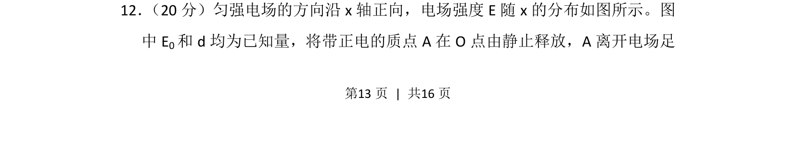
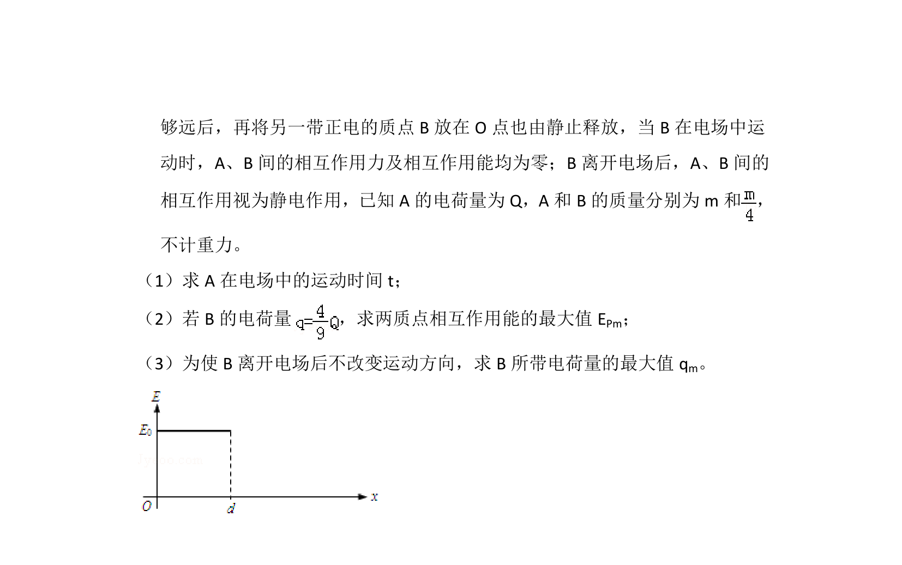
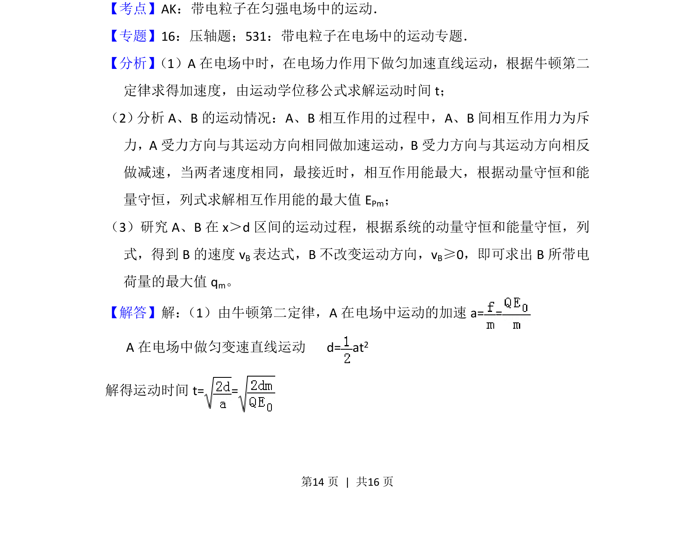
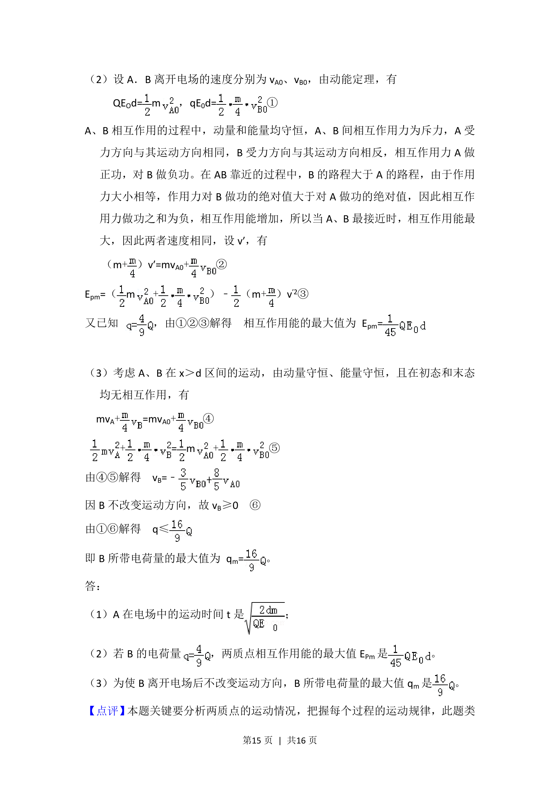
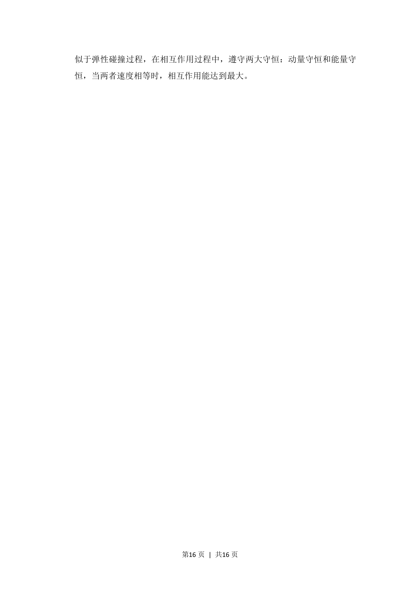

## 题面

## 摘要

带电质点在非匀强电场中由静止释放，利用动能定理分析运动过程。

## 关联考点

- [[277-电场强度|电场强度]]
- [[163-电压|电势差]]
- [[251-动能定理|动能定理]]

## 答案与解析

> 📄 原 PDF 第 13 页：`素材/真题/北京/2008-2024·（北京）物理高考真题/2012年高考物理试卷（北京）（解析卷）.pdf`
