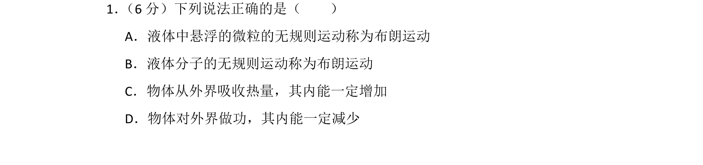
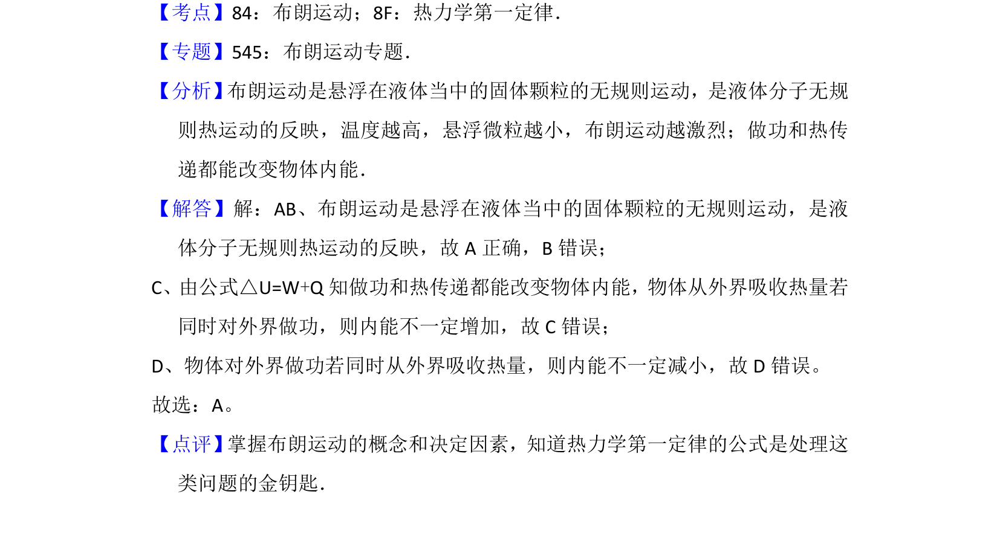

## 题面

## 摘要

布朗运动的定义及热力学第一定律对内能变化的影响

## 关联考点

- [[130-分子热运动|布朗运动]]
- [[440-热力学第一定律|热力学第一定律]]

## 答案与解析

> 📄 原 PDF 第 1 页：`素材/真题/北京/2008-2024·（北京）物理高考真题/2013年高考物理试卷（北京）（解析卷）.pdf`

<!-- 题干文本-start -->
## 题干文本
1． （6分）下列说法正确的是（　　）
A．液体中悬浮的微粒的无规则运动称为布朗运动
B．液体分子的无规则运动称为布朗运动
C．物体从外界吸收热量，其内能一定增加
D．物体对外界做功，其内能一定减少
<!-- 题干文本-end -->

<!-- 解析文本-start -->
## 解析文本
【考点】84：布朗运动；8F：热力学第一定律．菁优网版权所有
【专题】545：布朗运动专题．
【分析】 布朗运动是悬浮在液体当中的固体颗粒的无规则运动，是液体分子无规
则热运动的反映，温度越高，悬浮微粒越小，布朗运动越激烈；做功和热传
递都能改变物体内能．
【解答】解：AB、布朗运动是悬浮在液体当中的固体颗粒的无规则运动，是液
体分子无规则热运动的反映，故A正确，B错误；
C、由公式△U=W+Q知做功和热传递都能改变物体内能，物体从外界吸收热量若
同时对外界做功，则内能不一定增加，故C错误；
D、物体对外界做功若同时从外界吸收热量，则内能不一定减小，故D错误。
故选：A。
【点评】 掌握布朗运动的概念和决定因素，知道热力学第一定律的公式是处理这
类问题的金钥匙．
<!-- 解析文本-end -->
