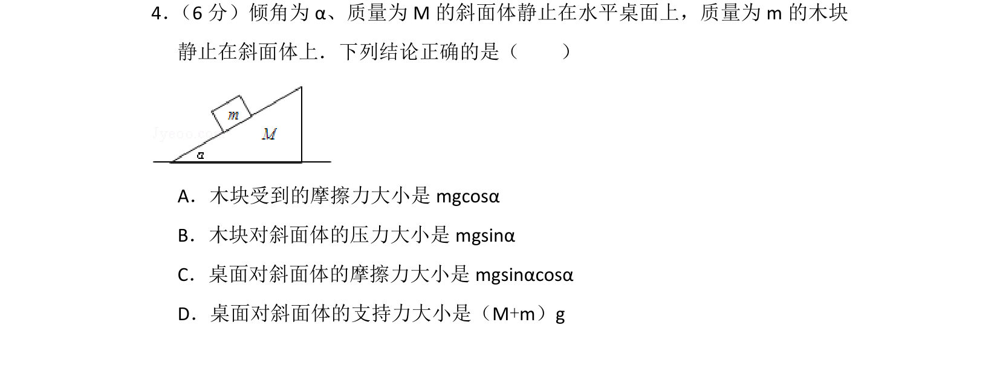
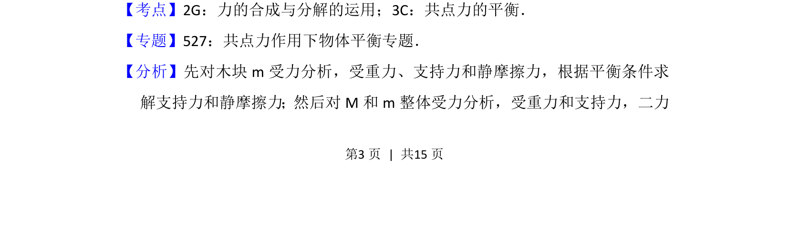
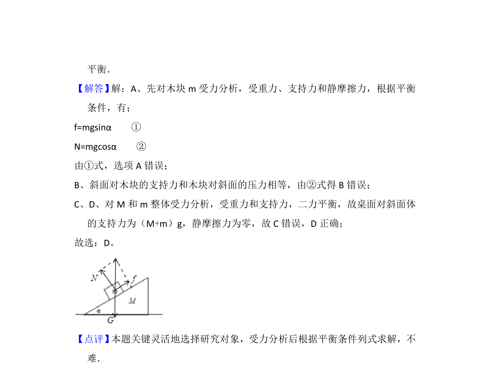

## 题面

## 摘要

木块静止在斜面体上，考查隔离法与整体法分析受力及共点力平衡条件。

## 关联考点

- [[532-力的合成与分解|力的合成与分解]]
- [[208-共点力平衡|共点力的平衡]]

## 答案与解析

> 📄 原 PDF 第 3 页：`素材/真题/北京/2008-2024·（北京）物理高考真题/2013年高考物理试卷（北京）（解析卷）.pdf`

<!-- 题干文本-start -->
## 题干文本
4． （6分）倾角为α、质量为M的斜面体静止在水平桌面上，质量为m的木块
静止在斜面体上．下列结论正确的是（　　）
A．木块受到的摩擦力大小是mgcosα
B．木块对斜面体的压力大小是mgsinα
C．桌面对斜面体的摩擦力大小是mgsinαcosα
D．桌面对斜面体的支持力大小是（M+m）g
<!-- 题干文本-end -->

<!-- 解析文本-start -->
## 解析文本
【考点】2G：力的合成与分解的运用；3C：共点力的平衡．菁优网版权所有
【专题】527：共点力作用下物体平衡专题．
【分析】先对木块m受力分析，受重力、支持力和静摩擦力，根据平衡条件求
解支持力和静摩擦力；然后对M和m整体受力分析，受重力和支持力，二力
<!-- 解析文本-end -->
