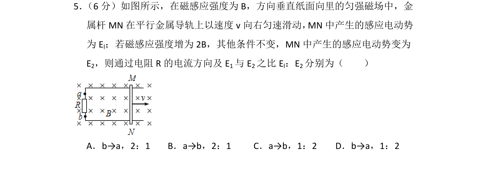
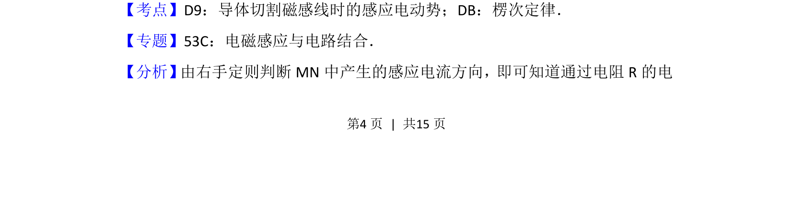
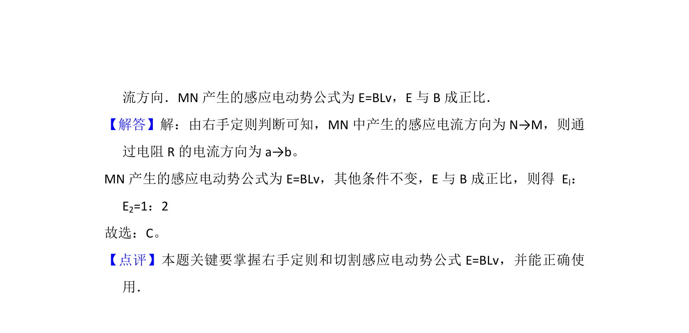

## 题面

## 摘要

导体切割磁感线时感应电动势的计算及右手定则判断电流方向，涉及磁感应强度变化对电动势的影响。

## 关联考点

- [[590-导体切割磁感线时的感应电动势|导体切割磁感线时的感应电动势]]
- [[393-楞次定律|楞次定律]]

## 答案与解析

> 📄 原 PDF 第 4 页：`素材/真题/北京/2008-2024·（北京）物理高考真题/2013年高考物理试卷（北京）（解析卷）.pdf`
