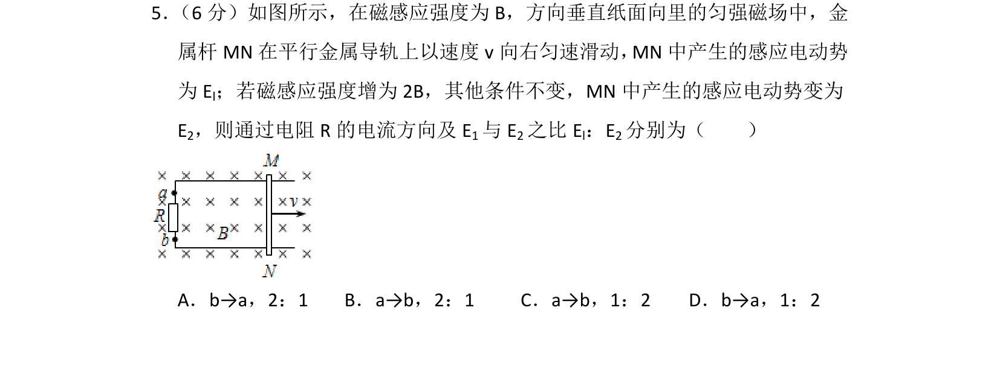
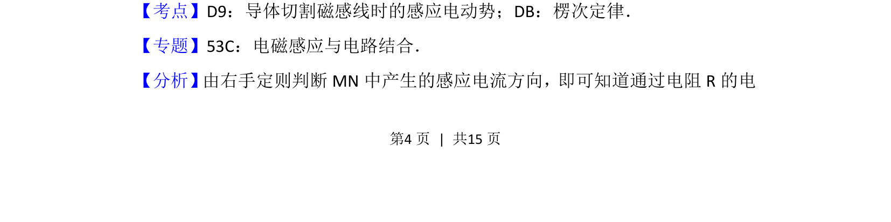
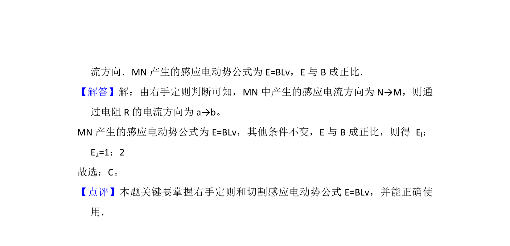

## 题面

## 摘要

导体切割磁感线时感应电动势的计算及右手定则判断电流方向，涉及磁感应强度变化对电动势的影响。

## 关联考点

- [[590-导体切割磁感线时的感应电动势|导体切割磁感线时的感应电动势]]
- [[393-楞次定律|楞次定律]]

## 答案与解析

> 📄 原 PDF 第 4 页：`素材/真题/北京/2008-2024·（北京）物理高考真题/2013年高考物理试卷（北京）（解析卷）.pdf`

<!-- 题干文本-start -->
## 题干文本
5． （6分）如图所示，在磁感应强度为B，方向垂直纸面向里的匀强磁场中，金
属杆MN在平行金属导轨上以速度v向右匀速滑动，MN中产生的感应电动势
为E l；若磁感应强度增为2B，其他条件不变，MN中产生的感应电动势变为
E2，则通过电阻R的电流方向及E 1与E 2之比E l：E2分别为（　　）
A．b→a，2：1 B．a→b，2：1 C．a→b，1：2 D．b→a，1：2
<!-- 题干文本-end -->

<!-- 解析文本-start -->
## 解析文本
【考点】D9：导体切割磁感线时的感应电动势；DB：楞次定律．菁优网版权所有
【专题】53C：电磁感应与电路结合．
【分析】 由右手定则判断MN中产生的感应电流方向，即可知道通过电阻R的电
<!-- 解析文本-end -->
