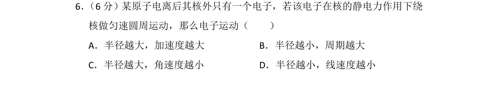
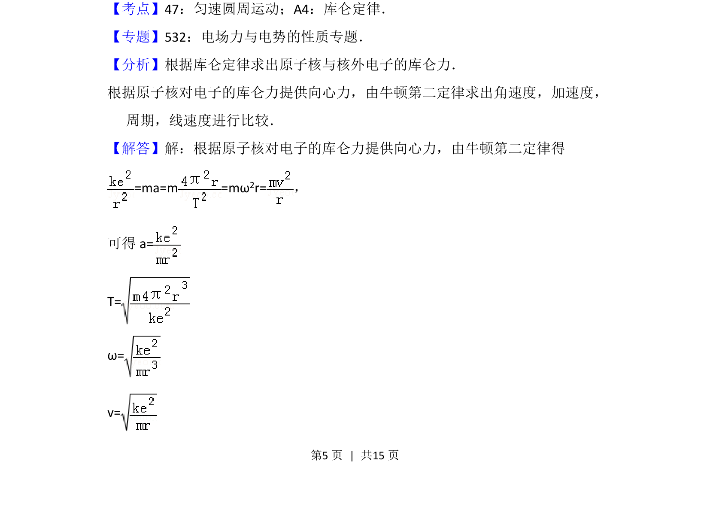
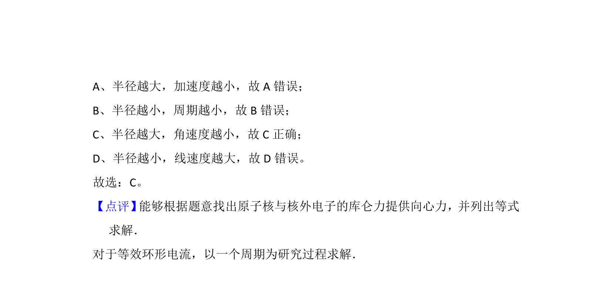

## 题面

## 摘要

电子在原子核库仑力作用下做匀速圆周运动，考查运动参量随半径的变化关系。

## 关联考点

- [[263-库仑定律|库仑定律]]
- [[253-匀速圆周运动|匀速圆周运动]]
- [[256-向心力|向心力]]
- [[229-牛顿第二定律|牛顿第二定律]]

## 答案与解析

> 📄 原 PDF 第 5 页：`素材/真题/北京/2008-2024·（北京）物理高考真题/2013年高考物理试卷（北京）（解析卷）.pdf`
