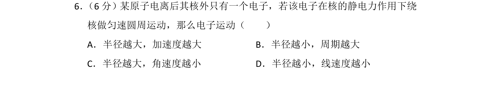
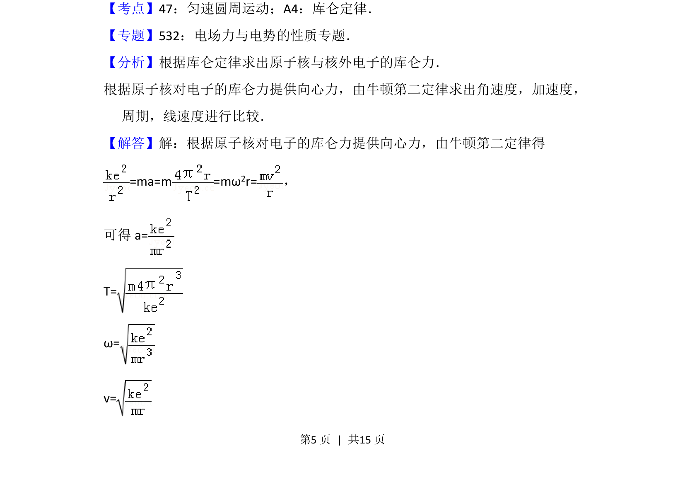
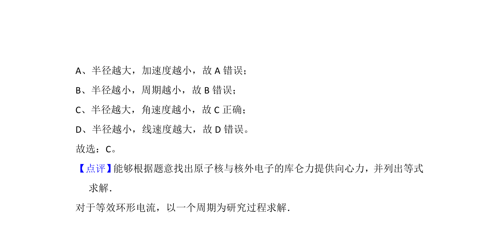

## 题面

## 摘要

电子在原子核库仑力作用下做匀速圆周运动，考查运动参量随半径的变化关系。

## 关联考点

- [[263-库仑定律|库仑定律]]
- [[253-匀速圆周运动|匀速圆周运动]]
- [[256-向心力|向心力]]
- [[229-牛顿第二定律|牛顿第二定律]]

## 答案与解析

> 📄 原 PDF 第 5 页：`素材/真题/北京/2008-2024·（北京）物理高考真题/2013年高考物理试卷（北京）（解析卷）.pdf`

<!-- 题干文本-start -->
## 题干文本
6． （6分）某原子电离后其核外只有一个电子，若该电子在核的静电力作用下绕
核做匀速圆周运动，那么电子运动（　　）
A．半径越大，加速度越大B．半径越小，周期越大
C．半径越大，角速度越小D．半径越小，线速度越小
<!-- 题干文本-end -->

<!-- 解析文本-start -->
## 解析文本
【考点】47：匀速圆周运动；A4：库仑定律．菁优网版权所有
【专题】532：电场力与电势的性质专题．
【分析】根据库仑定律求出原子核与核外电子的库仑力．
根据原子核对电子的库仑力提供向心力，由牛顿第二定律求出角速度，加速度，
周期，线速度进行比较．
【解答】解：根据原子核对电子的库仑力提供向心力，由牛顿第二定律得
=ma=m=mω 2r=，
可得a=
T=
ω=
v=
<!-- 解析文本-end -->
