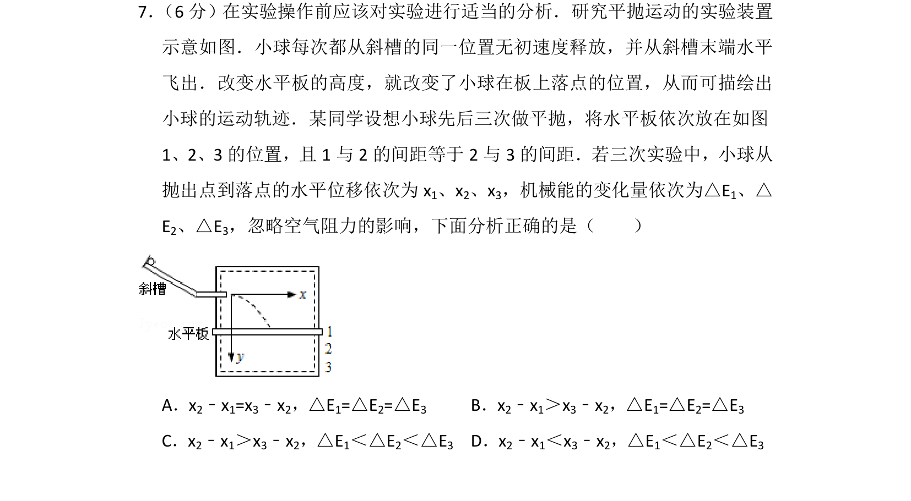
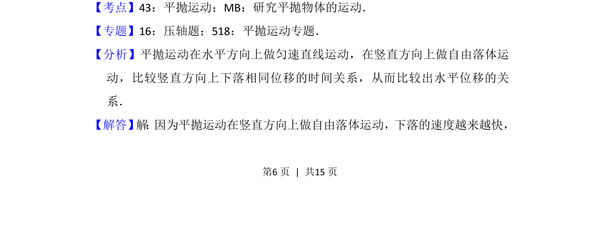
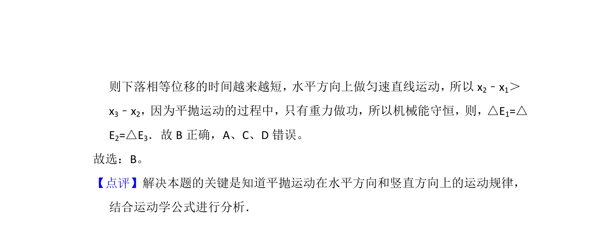

## 题面

## 摘要

研究平抛运动实验中不同水平板位置下的水平位移差与机械能变化分析

## 关联考点

- [[261-平抛运动|平抛运动]]
- [[085-机械能守恒-初中|机械能守恒]]
- [[482-实验设计|实验探究]]

## 答案与解析

> 📄 原 PDF 第 6 页：`素材/真题/北京/2008-2024·（北京）物理高考真题/2013年高考物理试卷（北京）（解析卷）.pdf`

<!-- 题干文本-start -->
## 题干文本
7． （6分）在实验操作前应该对实验进行适当的分析．研究平抛运动的实验装置
示意如图．小球每次都从斜槽的同一位置无初速度释放，并从斜槽末端水平
飞出．改变水平板的高度，就改变了小球在板上落点的位置，从而可描绘出
小球的运动轨迹．某同学设想小球先后三次做平抛，将水平板依次放在如图
1、2、3的位置，且1与2的间距等于2与3的间距．若三次实验中，小球从
抛出点到落点的水平位移依次为x 1、x2、x3，机械能的变化量依次为△E1、△
E2、△E3，忽略空气阻力的影响，下面分析正确的是（　　）
A．x2﹣x1=x3﹣x2，△E1=△E2=△E3 B．x2﹣x1＞x3﹣x2，△E1=△E2=△E3
C．x2﹣x1＞x3﹣x2，△E1＜△E2＜△E3 D．x2﹣x1＜x3﹣x2，△E1＜△E2＜△E3
<!-- 题干文本-end -->

<!-- 解析文本-start -->
## 解析文本
【考点】43：平抛运动；MB：研究平抛物体的运动．菁优网版权所有
【专题】16：压轴题；518：平抛运动专题．
【分析】平抛运动在水平方向上做匀速直线运动，在竖直方向上做自由落体运
动，比较竖直方向上下落相同位移的时间关系，从而比较出水平位移的关
系．
【解答】 解 ： 因为平抛运动在竖直方向上做自由落体运动，下落的速度越来越快，
<!-- 解析文本-end -->
