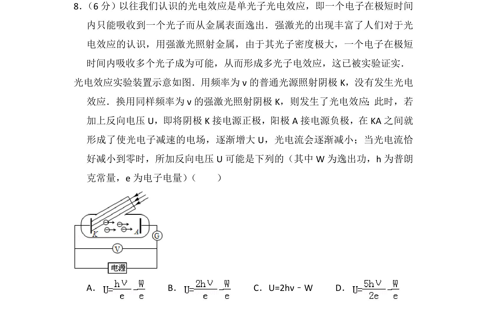
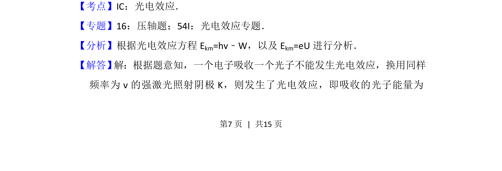
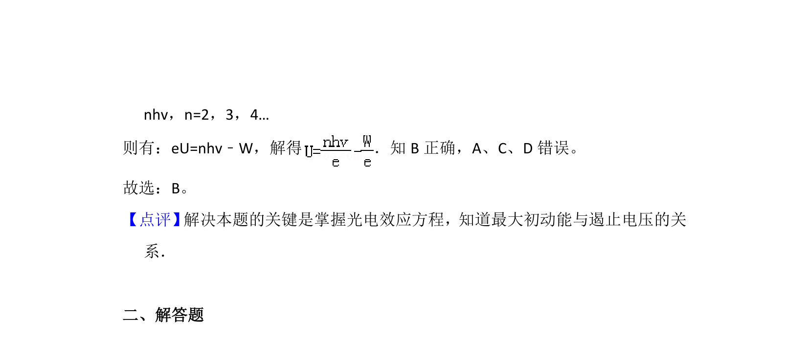

## 题面

## 摘要

用强激光照射金属发生多光子光电效应，求反向遏止电压的可能表达式，涉及吸收多个光子能量与逸出功的关系。

## 关联考点

- [[417-光电效应|光电效应]]
- [[多光子光电效应]]
- [[781-遏止电压|遏止电压]]
- [[838-光电效应方程|光电效应方程]]

## 答案与解析

> 📄 原 PDF 第 7 页：`素材/真题/北京/2008-2024·（北京）物理高考真题/2013年高考物理试卷（北京）（解析卷）.pdf`
