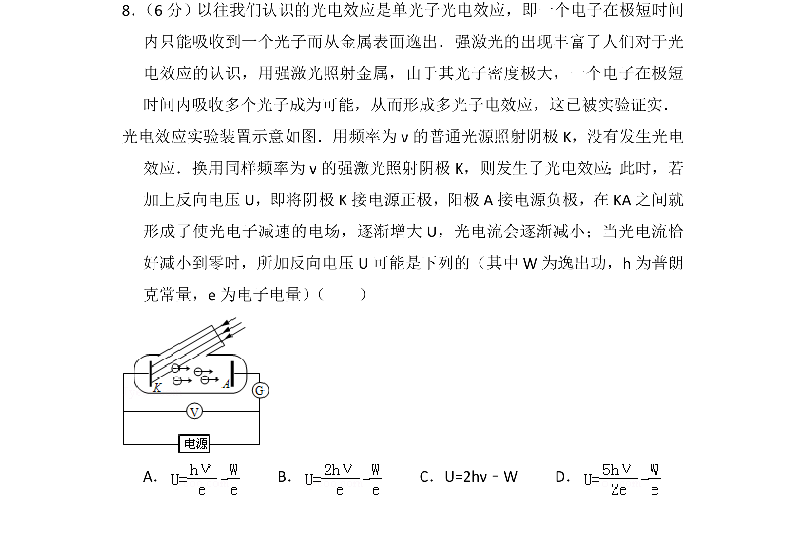
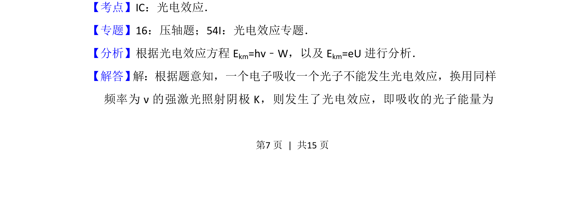
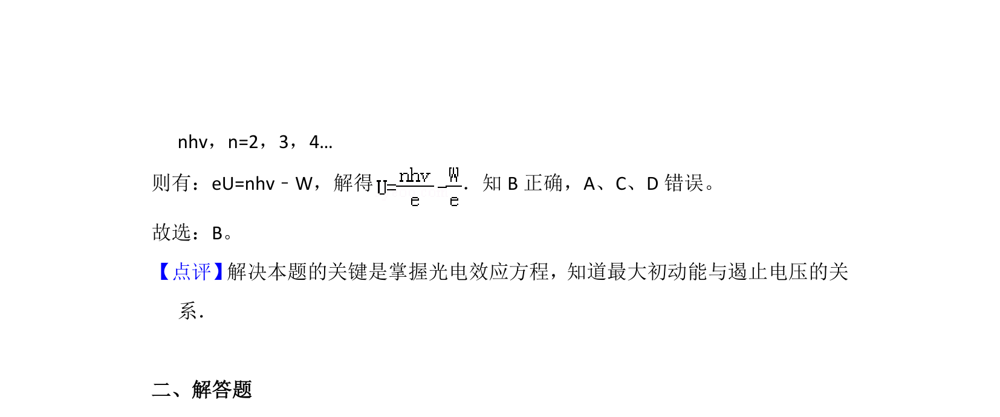

## 题面

## 摘要

用强激光照射金属发生多光子光电效应，求反向遏止电压的可能表达式，涉及吸收多个光子能量与逸出功的关系。

## 关联考点

- [[417-光电效应|光电效应]]
- [[多光子光电效应]]
- [[781-遏止电压|遏止电压]]
- [[838-光电效应方程|光电效应方程]]

## 答案与解析

> 📄 原 PDF 第 7 页：`素材/真题/北京/2008-2024·（北京）物理高考真题/2013年高考物理试卷（北京）（解析卷）.pdf`

<!-- 题干文本-start -->
## 题干文本
8． （6分）以往我们认识的光电效应是单光子光电效应，即一个电子在极短时间
内只能吸收到一个光子而从金属表面逸出．强激光的出现丰富了人们对于光
电效应的认识，用强激光照射金属，由于其光子密度极大，一个电子在极短
时间内吸收多个光子成为可能，从而形成多光子电效应，这已被实验证实．
光电效应实验装置示意如图．用频率为ν的普通光源照射阴极K，没有发生光电
效应．换用同样频率为ν的强激光照射阴极K，则发生了光电效应；此时，若
加上反向电压U，即将阴极K接电源正极，阳极A接电源负极，在KA之间就
形成了使光电子减速的电场，逐渐增大U，光电流会逐渐减小；当光电流恰
好减小到零时，所加反向电压U可能是下列的（其中W为逸出功，h为普朗
克常量，e为电子电量） （　　）
A．B．C．U=2hν﹣W D．
<!-- 题干文本-end -->

<!-- 解析文本-start -->
## 解析文本
【考点】IC：光电效应．菁优网版权所有
【专题】16：压轴题；54I：光电效应专题．
【分析】根据光电效应方程E km=hv﹣W，以及E km=eU进行分析．
【解答】 解：根据题意知，一个电子吸收一个光子不能发生光电效应，换用同样
频率为ν的强激光照射阴极K，则发生了光电效应，即吸收的光子能量为
<!-- 解析文本-end -->
