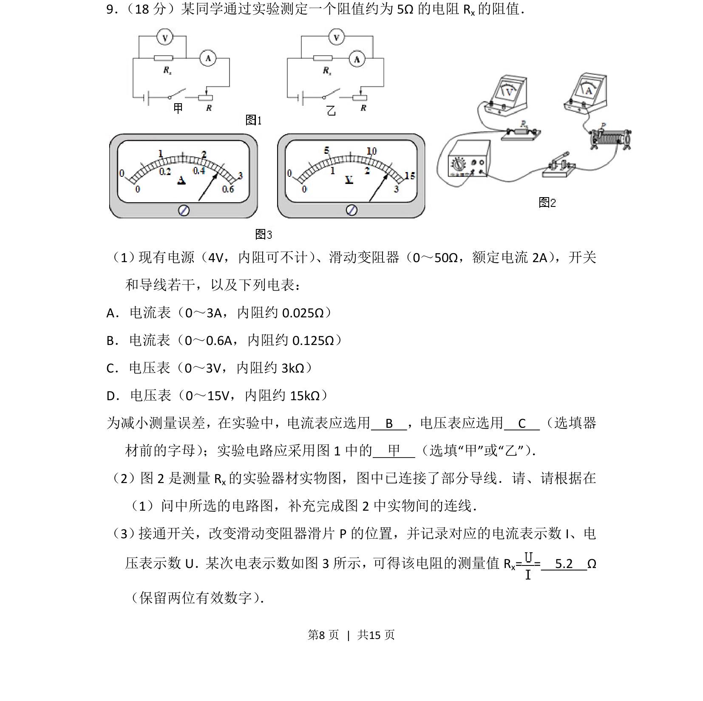
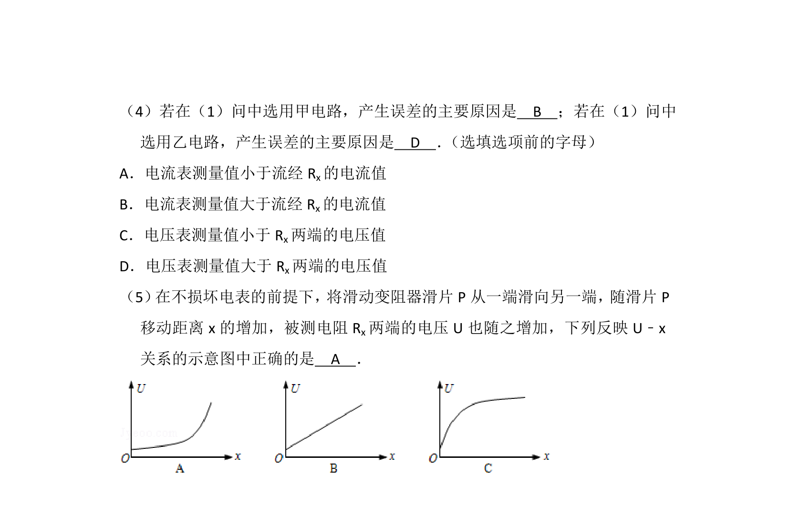
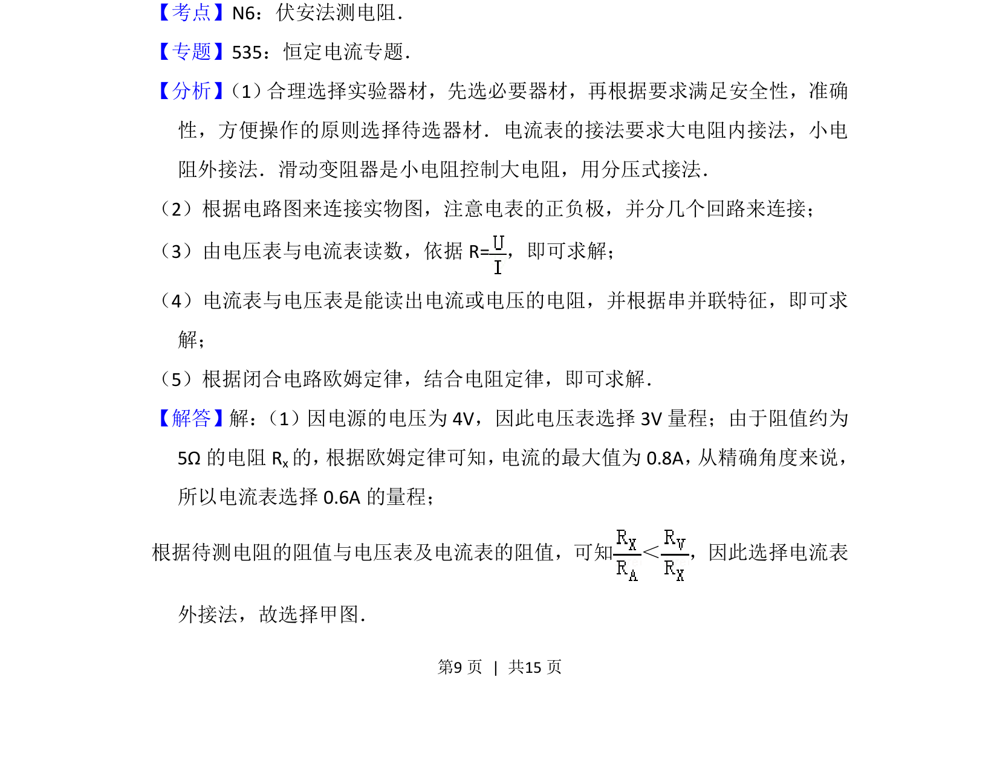
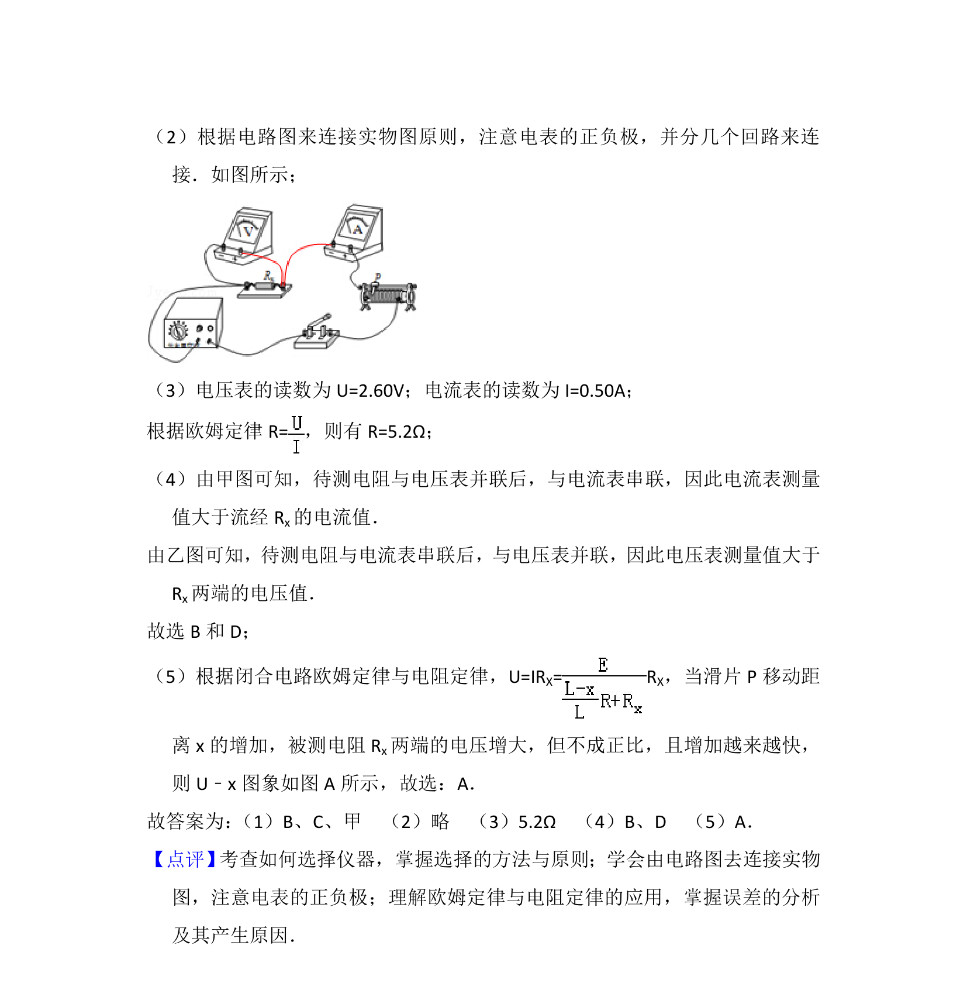

## 题面

## 摘要

测定电阻阻值实验，涉及电表选择、电路接法及实物连线，并计算电阻值。

## 关联考点

- [[511-伏安法测电阻|伏安法测电阻]]
- [[电表选择]]
- [[833-电流表内外接|电流表内外接]]
- [[实物图连接]]

## 答案与解析

> 📄 原 PDF 第 8 页：`素材/真题/北京/2008-2024·（北京）物理高考真题/2013年高考物理试卷（北京）（解析卷）.pdf`

<!-- 题干文本-start -->
## 题干文本
9． （18分）某同学通过实验测定一个阻值约为5Ω的电阻Rx的阻值．
（1） 现有电源（4V，内阻可不计） 、滑动变阻器（0～50Ω，额定电流2A） ，开关
和导线若干，以及下列电表：
A．电流表（0～3A，内阻约0.025Ω）
B．电流表（0～0.6A，内阻约0.125Ω）
C．电压表（0～3V，内阻约3kΩ）
D．电压表（0～15V，内阻约15kΩ）
为减小测量误差，在实验中，电流表应选用　B　，电压表应选用　C　（选填器
材前的字母） ；实验电路应采用图1中的　甲　（选填“甲”或“乙”） ．
（2）图2是测量R x的实验器材实物图，图中已连接了部分导线．请、请根据在
（1）问中所选的电路图，补充完成图2中实物间的连线．
（3） 接通开关，改变滑动变阻器滑片P的位置，并记录对应的电流表示数I、电
压表示数U．某次电表示数如图3所示，可得该电阻的测量值R x= =　5.2　Ω
（保留两位有效数字） ．
<!-- 题干文本-end -->

<!-- 解析文本-start -->
## 解析文本

<!-- 解析文本-end -->
