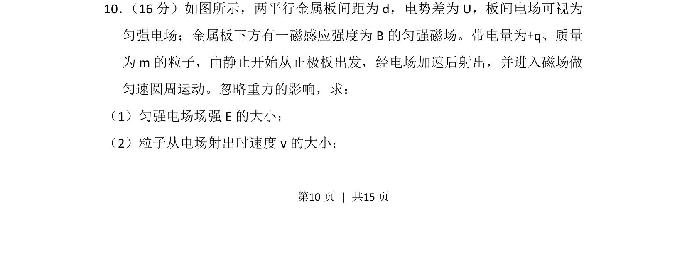
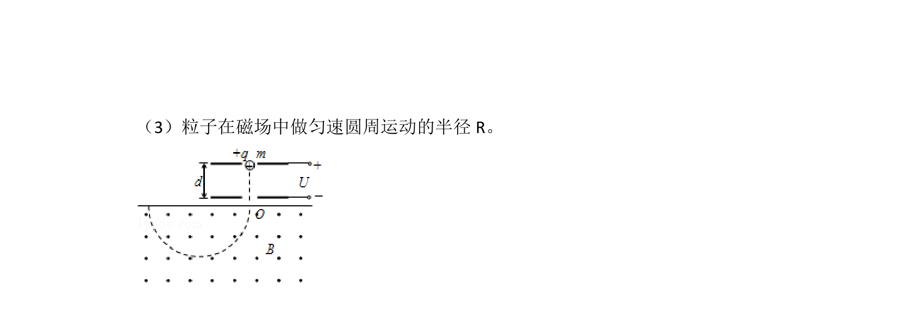
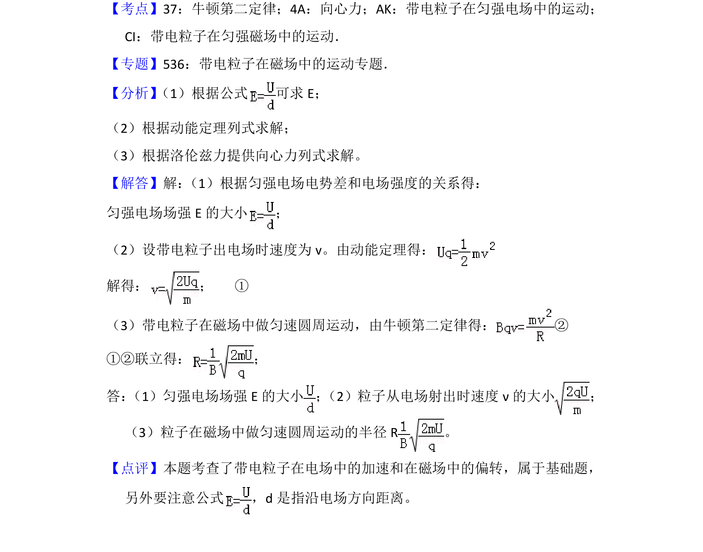

## 题面

## 摘要

粒子在电场中加速与磁场偏转问题，求匀强电场场强及粒子射出速度。

## 关联考点

- [[252-匀强电场|匀强电场]]
- [[251-动能定理|动能定理]]
- [[163-电压|电势差]]
- [[599-带电粒子运动|带电粒子运动]]

## 答案与解析

> 📄 原 PDF 第 10 页：`素材/真题/北京/2008-2024·（北京）物理高考真题/2013年高考物理试卷（北京）（解析卷）.pdf`
