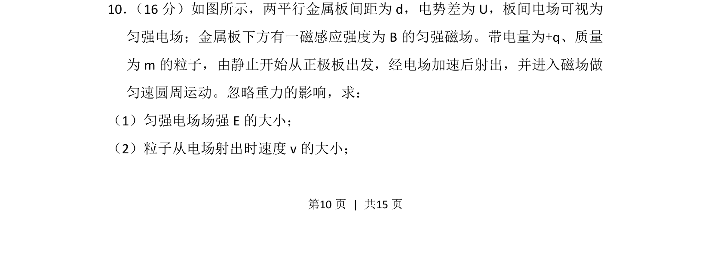
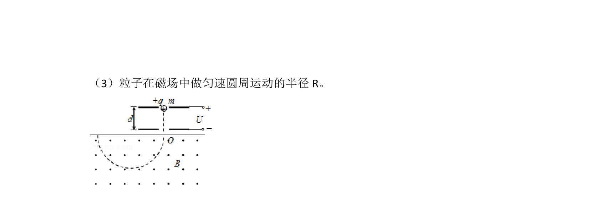
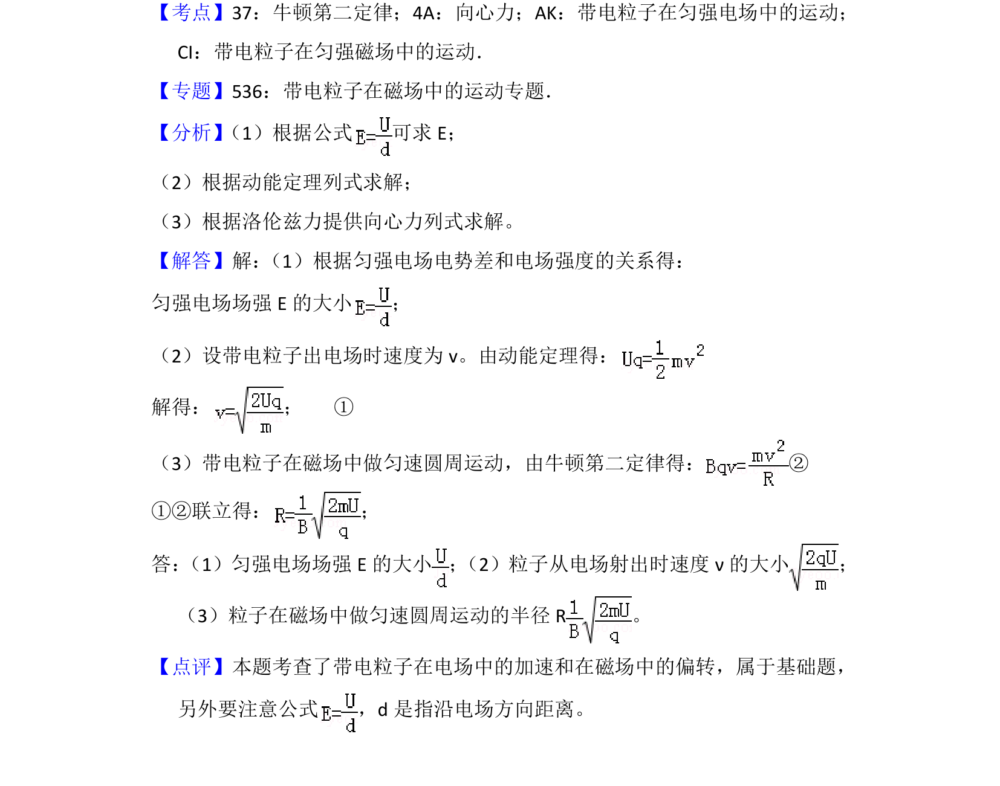

## 题面

## 摘要

粒子在电场中加速与磁场偏转问题，求匀强电场场强及粒子射出速度。

## 关联考点

- [[252-匀强电场|匀强电场]]
- [[251-动能定理|动能定理]]
- [[163-电压|电势差]]
- [[599-带电粒子运动|带电粒子运动]]

## 答案与解析

> 📄 原 PDF 第 10 页：`素材/真题/北京/2008-2024·（北京）物理高考真题/2013年高考物理试卷（北京）（解析卷）.pdf`

<!-- 题干文本-start -->
## 题干文本
10． （16分）如图所示，两平行金属板间距为d，电势差为U，板间电场可视为
匀强电场；金属板下方有一磁感应强度为B的匀强磁场。带电量为+q、质量
为m的粒子，由静止开始从正极板出发，经电场加速后射出，并进入磁场做
匀速圆周运动。忽略重力的影响，求：
（1）匀强电场场强E的大小；
（2）粒子从电场射出时速度v的大小；
<!-- 题干文本-end -->

<!-- 解析文本-start -->
## 解析文本

<!-- 解析文本-end -->
