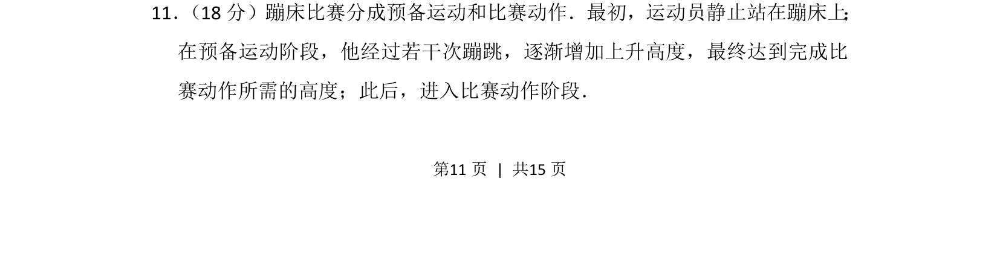
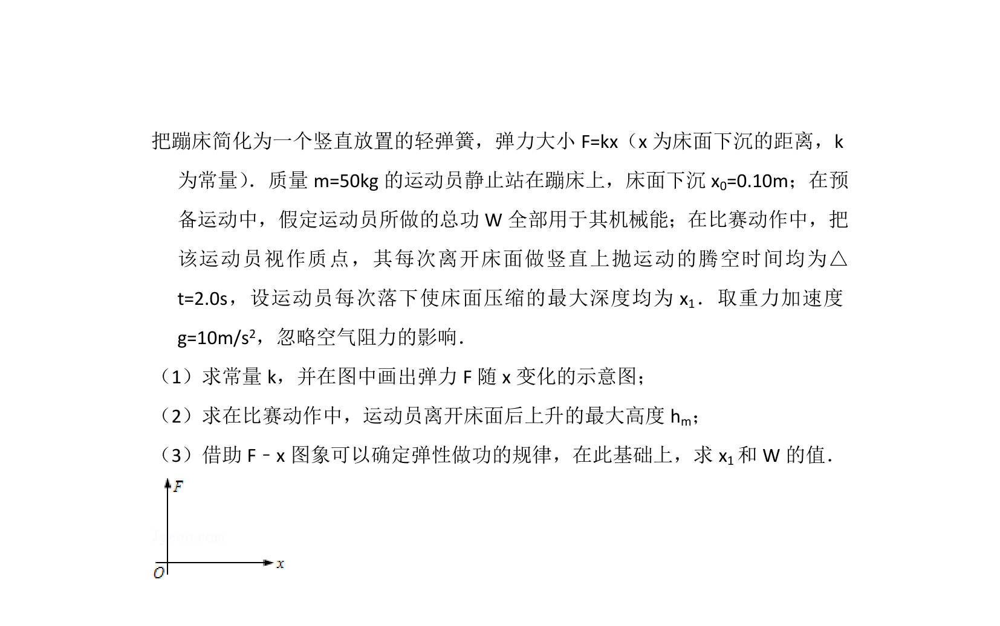
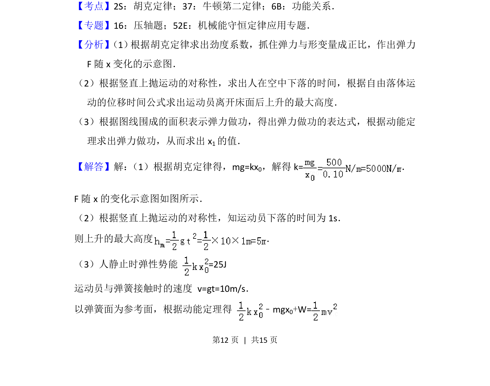
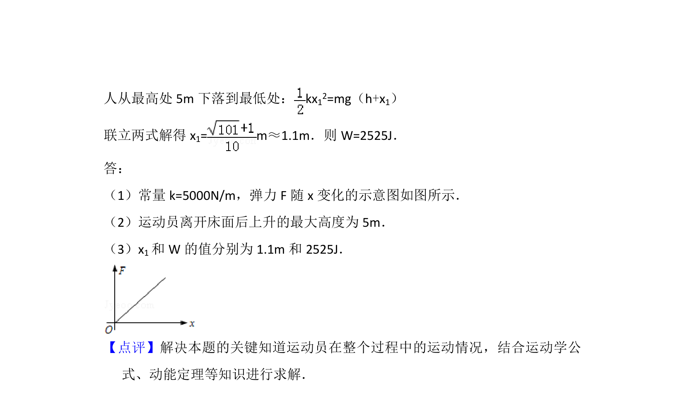

## 题面

## 摘要

蹦床运动中，运动员通过预备蹦跳逐渐增大高度，涉及机械能守恒与牛顿运动定律的综合运用。

## 关联考点

- [[085-机械能守恒-初中|机械能守恒定律]]
- [[1176-牛顿运动定律|牛顿运动定律]]
- [[795-匀变速直线运动规律|匀变速直线运动规律]]

## 答案与解析

> 📄 原 PDF 第 11 页：`素材/真题/北京/2008-2024·（北京）物理高考真题/2013年高考物理试卷（北京）（解析卷）.pdf`
