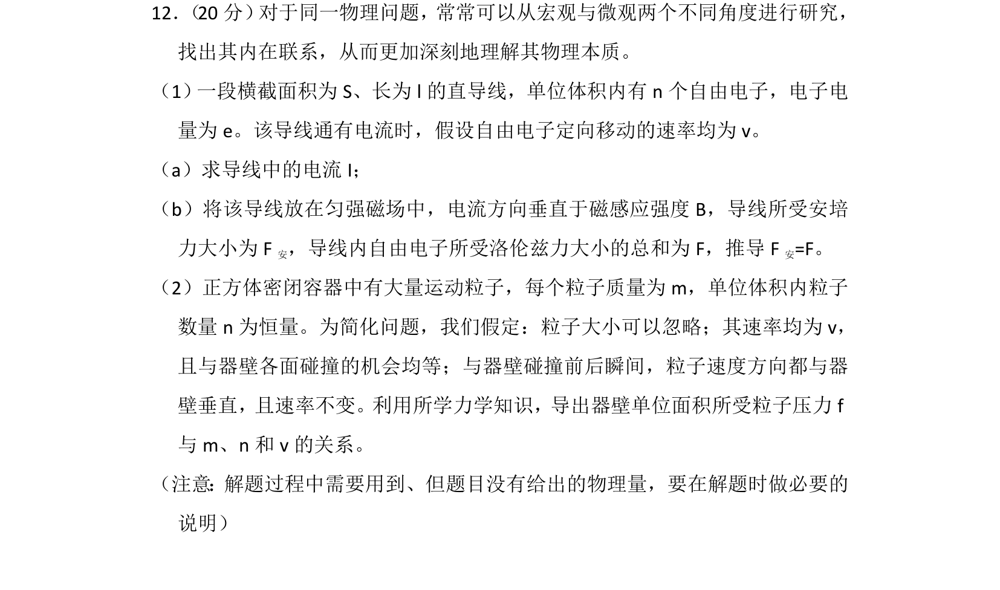
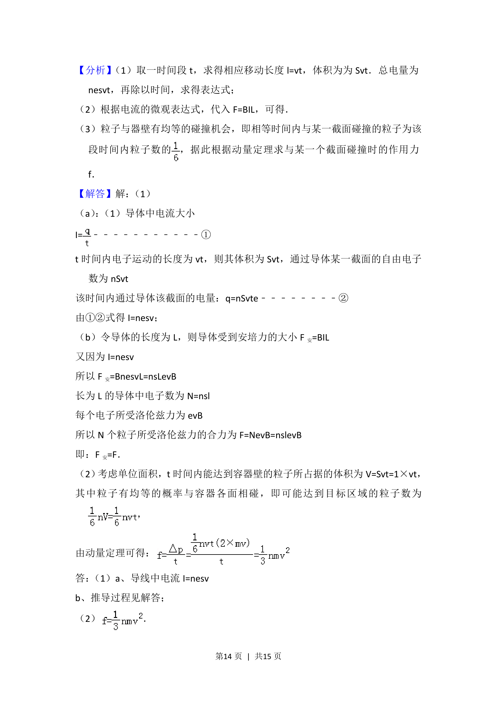
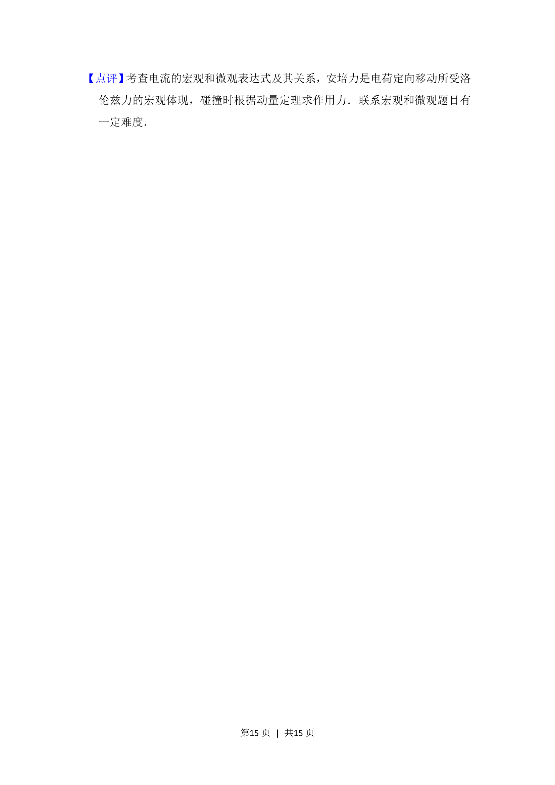

## 题面

## 摘要

该题从微观角度研究电流、安培力与洛伦兹力关系，并利用动量定理推导气体压强微观表达式。

## 关联考点

- [[电流微观表达式]]
- [[188-磁场对通电导体的作用|安培力]]
- [[304-洛伦兹力|洛伦兹力]]
- [[349-动量定理|动量定理]]

## 答案与解析

> 📄 原 PDF 第 13 页：`素材/真题/北京/2008-2024·（北京）物理高考真题/2013年高考物理试卷（北京）（解析卷）.pdf`
