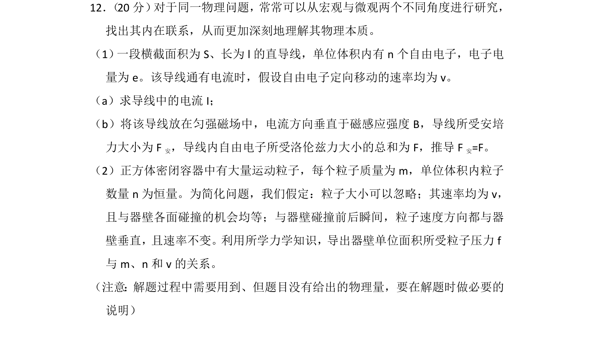
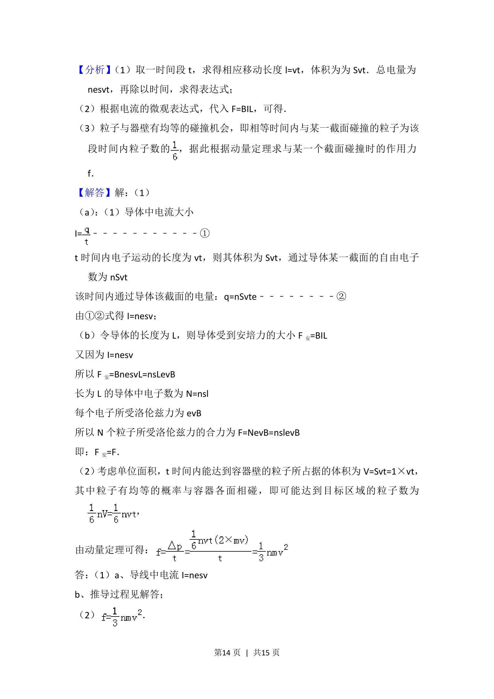
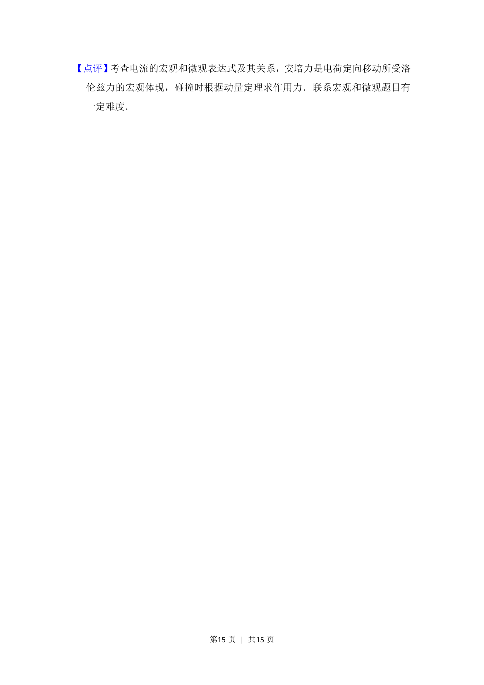

## 题面

## 摘要

该题从微观角度研究电流、安培力与洛伦兹力关系，并利用动量定理推导气体压强微观表达式。

## 关联考点

- [[849-电流微观表达式|电流微观表达式]]
- [[188-磁场对通电导体的作用|安培力]]
- [[304-洛伦兹力|洛伦兹力]]
- [[349-动量定理|动量定理]]

## 答案与解析

> 📄 原 PDF 第 13 页：`素材/真题/北京/2008-2024·（北京）物理高考真题/2013年高考物理试卷（北京）（解析卷）.pdf`

<!-- 题干文本-start -->
## 题干文本
12． （20分） 对于同一物理问题，常常可以从宏观与微观两个不同角度进行研究，
找出其内在联系，从而更加深刻地理解其物理本质。
（1） 一段横截面积为S、长为l的直导线，单位体积内有n个自由电子，电子电
量为e。该导线通有电流时，假设自由电子定向移动的速率均为v。
（a）求导线中的电流I；
（b）将该导线放在匀强磁场中，电流方向垂直于磁感应强度B，导线所受安培
力大小为F 安，导线内自由电子所受洛伦兹力大小的总和为F，推导F 安=F。
（2）正方体密闭容器中有大量运动粒子，每个粒子质量为m，单位体积内粒子
数量n为恒量。为简化问题，我们假定：粒子大小可以忽略；其速率均为v，
且与器壁各面碰撞的机会均等；与器壁碰撞前后瞬间，粒子速度方向都与器
壁垂直，且速率不变。利用所学力学知识，导出器壁单位面积所受粒子压力f
与m、n和v的关系。
（注意：解题过程中需要用到、但题目没有给出的物理量，要在解题时做必要的
说明）
<!-- 题干文本-end -->

<!-- 解析文本-start -->
## 解析文本
【考点】52：动量定理；B1：电流、电压概念；CC：安培力．菁优网版权所有
【专题】16：压轴题；52F：动量定理应用专题．
<!-- 解析文本-end -->
