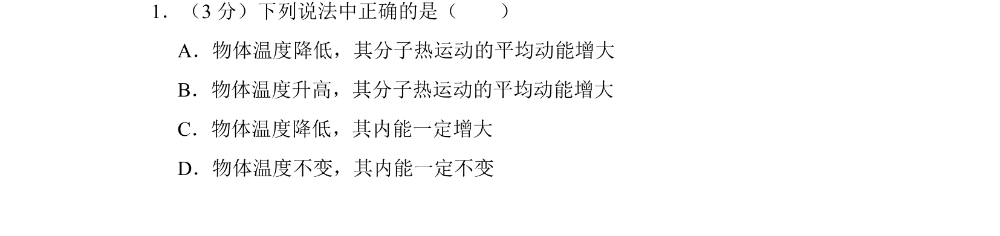
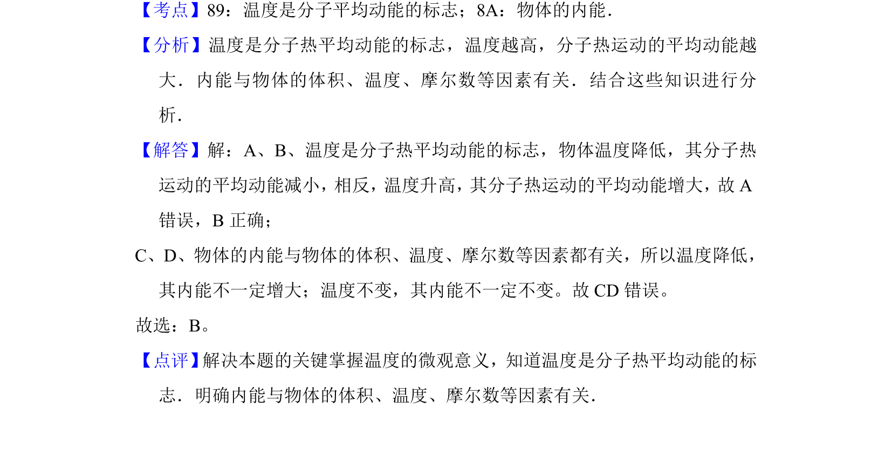

## 题面

## 摘要

本题考查温度是分子平均动能的标志及内能影响因素的选择题。

## 关联考点

- [[温度是分子平均动能的标志]]
- [[664-物体的内能|物体的内能]]

## 答案与解析

> 📄 原 PDF 第 1 页：`素材/真题/北京/2008-2024·（北京）物理高考真题/2014年高考物理试卷（北京）（解析卷）.pdf`

<!-- 题干文本-start -->
## 题干文本
1．（3分）下列说法中正确的是（　　）
A．物体温度降低，其分子热运动的平均动能增大
B．物体温度升高，其分子热运动的平均动能增大
C．物体温度降低，其内能一定增大
D．物体温度不变，其内能一定不变
<!-- 题干文本-end -->

<!-- 解析文本-start -->
## 解析文本
【考点】89：温度是分子平均动能的标志；8A：物体的内能．菁优网版权所有
【分析】温度是分子热平均动能的标志，温度越高，分子热运动的平均动能越
大．内能与物体的体积、温度、摩尔数等因素有关．结合这些知识进行分
析．
【解答】解：A、B、温度是分子热平均动能的标志，物体温度降低，其分子热
运动的平均动能减小，相反，温度升高，其分子热运动的平均动能增大，故A
错误，B正确；
C、D、物体的内能与物体的体积、温度、摩尔数等因素都有关，所以温度降低，
其内能不一定增大；温度不变，其内能不一定不变。故CD错误。
故选：B。
【点评】 解决本题的关键掌握温度的微观意义，知道温度是分子热平均动能的标
志．明确内能与物体的体积、温度、摩尔数等因素有关．
<!-- 解析文本-end -->
