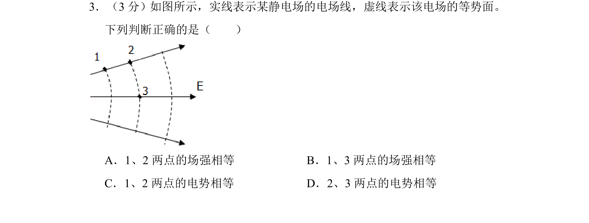
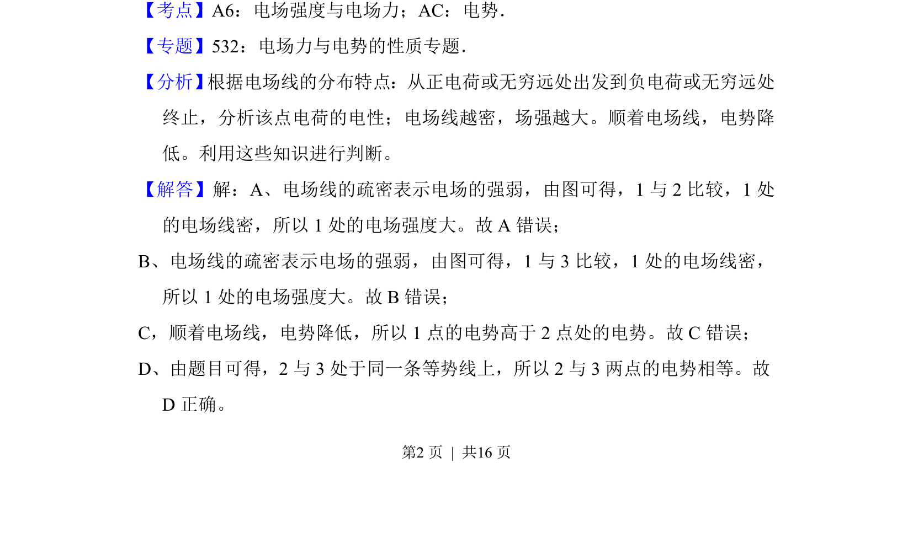
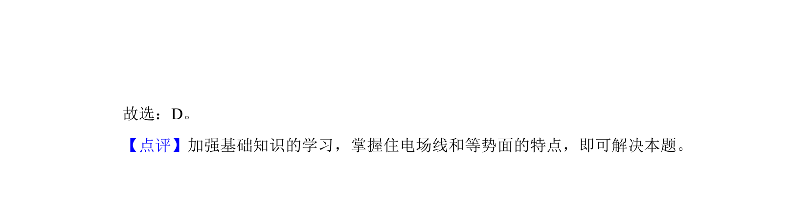

## 题面

## 摘要

通过电场线与等势面分布判断场强大小与电势高低

## 关联考点

- [[277-电场强度|电场强度]]
- [[278-电场线|电场线]]
- [[282-等势面|等势面]]
- [[308-电势|电势]]

## 答案与解析

> 📄 原 PDF 第 2 页：`素材/真题/北京/2008-2024·（北京）物理高考真题/2014年高考物理试卷（北京）（解析卷）.pdf`
