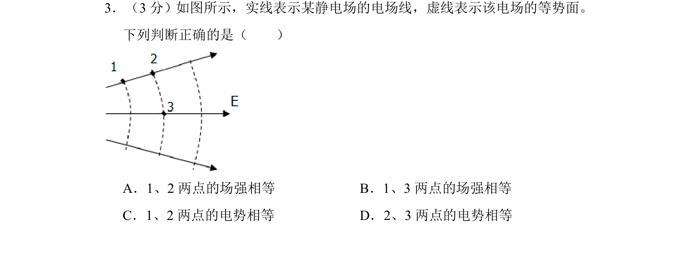
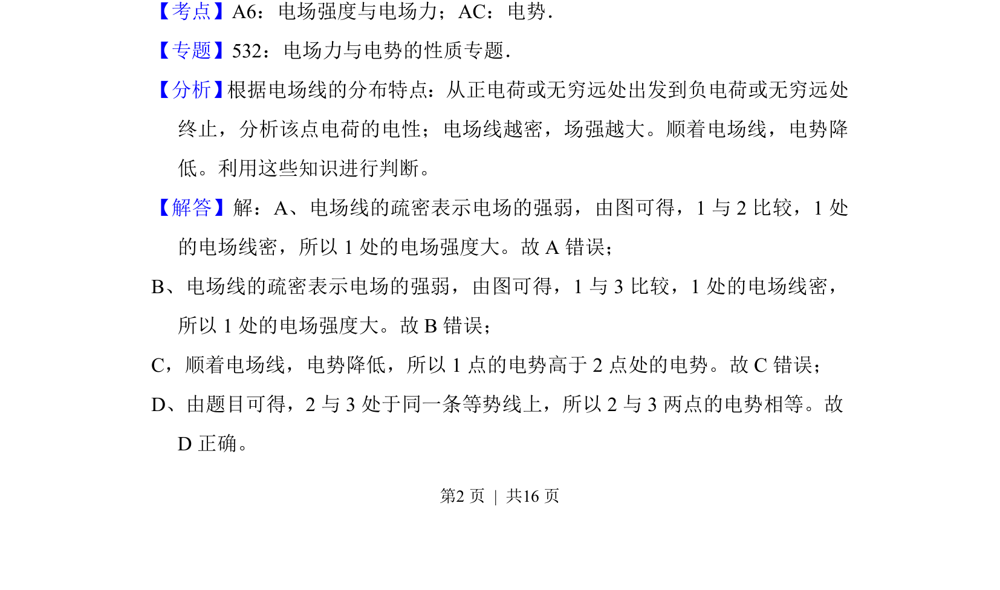
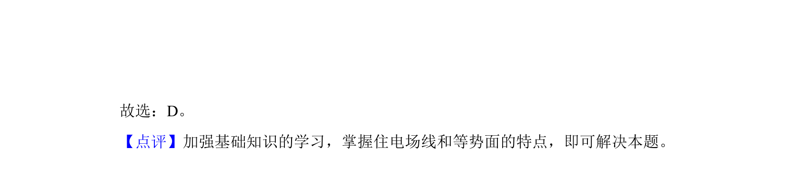

## 题面

## 摘要

通过电场线与等势面分布判断场强大小与电势高低

## 关联考点

- [[277-电场强度|电场强度]]
- [[278-电场线|电场线]]
- [[282-等势面|等势面]]
- [[308-电势|电势]]

## 答案与解析

> 📄 原 PDF 第 2 页：`素材/真题/北京/2008-2024·（北京）物理高考真题/2014年高考物理试卷（北京）（解析卷）.pdf`

<!-- 题干文本-start -->
## 题干文本
3．（3分）如图所示，实线表示某静电场的电场线，虚线表示该电场的等势面。
下列判断正确的是（　　）
A．1、2两点的场强相等B．1、3两点的场强相等
C．1、2两点的电势相等D．2、3两点的电势相等
<!-- 题干文本-end -->

<!-- 解析文本-start -->
## 解析文本
【考点】A6：电场强度与电场力；AC：电势．菁优网版权所有
【专题】532：电场力与电势的性质专题．
【分析】 根据电场线的分布特点：从正电荷或无穷远处出发到负电荷或无穷远处
终止，分析该点电荷的电性；电场线越密，场强越大。顺着电场线，电势降
低。利用这些知识进行判断。
【解答】解：A、电场线的疏密表示电场的强弱，由图可得，1与2比较，1处
的电场线密，所以1处的电场强度大。故A错误；
B、电场线的疏密表示电场的强弱，由图可得，1与3比较，1处的电场线密，
所以1处的电场强度大。故B错误；
C，顺着电场线，电势降低，所以1点的电势高于2点处的电势。故C错误；
D、由题目可得，2与3处于同一条等势线上，所以2与3两点的电势相等。故
D正确。
<!-- 解析文本-end -->
