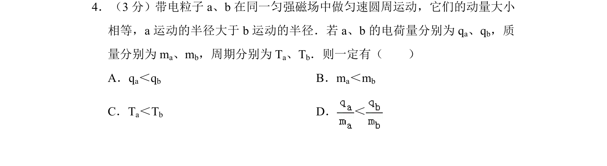
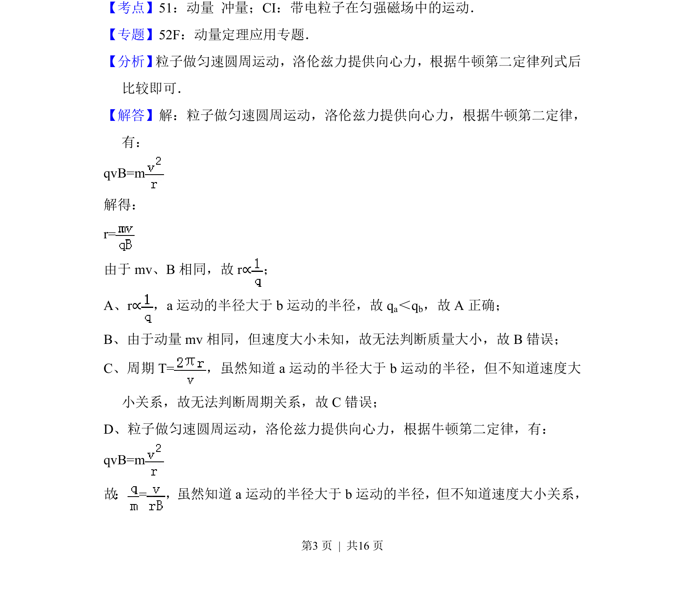
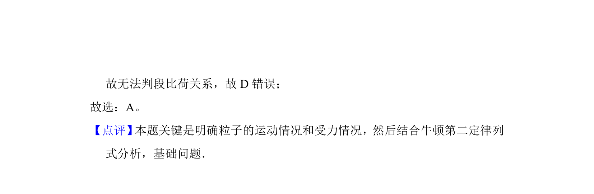

## 题面

## 摘要

带电粒子在匀强磁场中做匀速圆周运动，已知动量相等、半径不同，推断电荷量、质量、周期关系。

## 关联考点

- [[595-带电粒子在匀强磁场中的运动|带电粒子在匀强磁场中的运动]]
- [[304-洛伦兹力|洛伦兹力]]
- [[256-向心力|向心力]]
- [[346-动量|动量]]
- [[261-周期|周期]]

## 答案与解析

> 📄 原 PDF 第 3 页：`素材/真题/北京/2008-2024·（北京）物理高考真题/2014年高考物理试卷（北京）（解析卷）.pdf`
