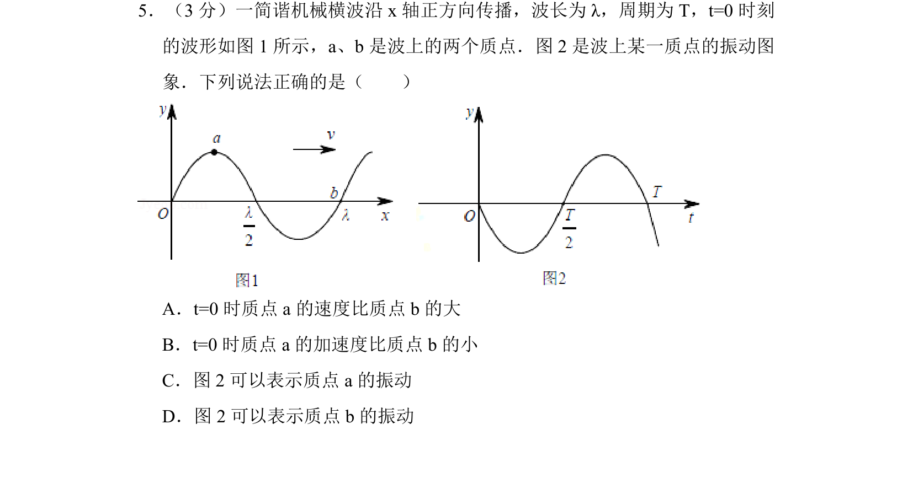
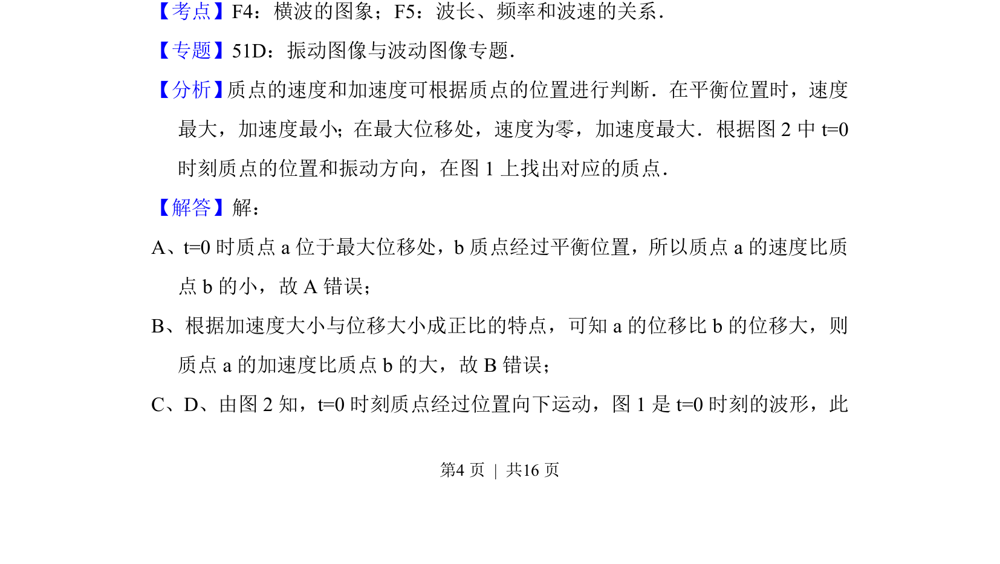
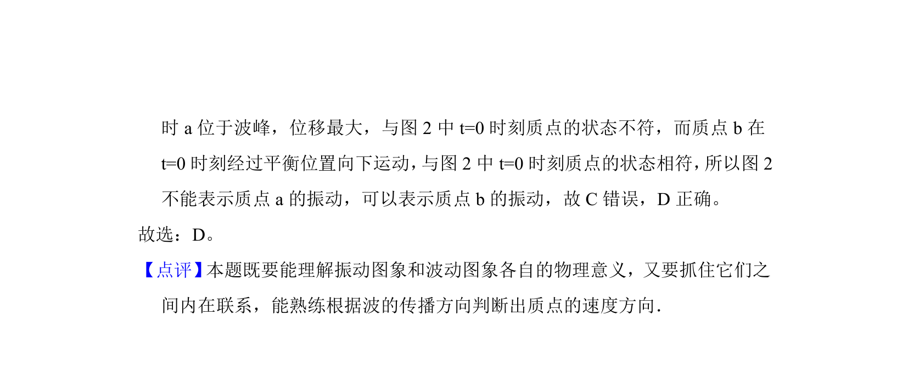

## 题面

## 摘要

根据波动与振动图像判断质点速度和加速度，并匹配对应质点。

## 关联考点

- [[630-横波的图象|横波的图象]]
- [[648-波长频率和波速的关系|波长频率和波速的关系]]
- [[857-振动图像|振动图像]]

## 答案与解析

> 📄 原 PDF 第 4 页：`素材/真题/北京/2008-2024·（北京）物理高考真题/2014年高考物理试卷（北京）（解析卷）.pdf`
