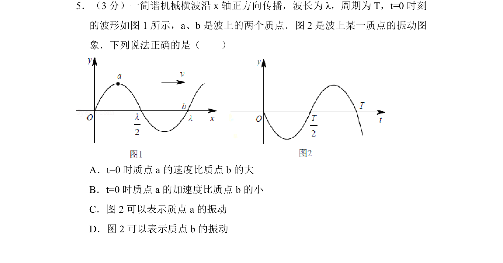
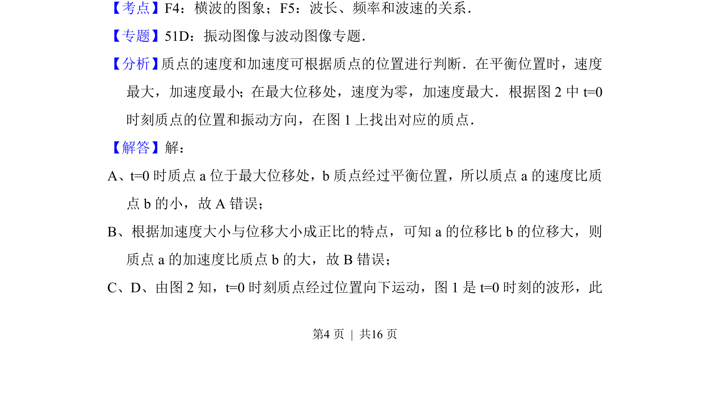
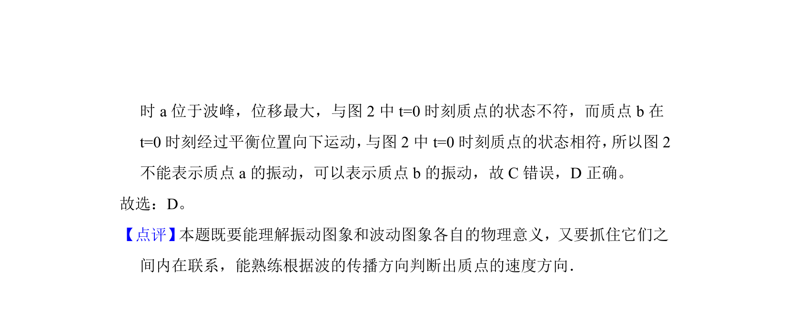

## 题面

## 摘要

根据波动与振动图像判断质点速度和加速度，并匹配对应质点。

## 关联考点

- [[630-横波的图象|横波的图象]]
- [[648-波长频率和波速的关系|波长频率和波速的关系]]
- [[857-振动图像|振动图像]]

## 答案与解析

> 📄 原 PDF 第 4 页：`素材/真题/北京/2008-2024·（北京）物理高考真题/2014年高考物理试卷（北京）（解析卷）.pdf`

<!-- 题干文本-start -->
## 题干文本
5．（3分）一简谐机械横波沿x轴正方向传播，波长为λ，周期为T，t=0时刻
的波形如图1所示，a、b是波上的两个质点．图2是波上某一质点的振动图
象．下列说法正确的是（　　）
A．t=0时质点a的速度比质点b的大
B．t=0时质点a的加速度比质点b的小
C．图2可以表示质点a的振动
D．图2可以表示质点b的振动
<!-- 题干文本-end -->

<!-- 解析文本-start -->
## 解析文本
【考点】F4：横波的图象；F5：波长、频率和波速的关系．菁优网版权所有
【专题】51D：振动图像与波动图像专题．
【分析】 质点的速度和加速度可根据质点的位置进行判断．在平衡位置时，速度
最大，加速度最小；在最大位移处，速度为零，加速度最大．根据图2中t=0
时刻质点的位置和振动方向，在图1上找出对应的质点．
【解答】解：
A、t=0时质点a位于最大位移处，b质点经过平衡位置，所以质点a的速度比质
点b的小，故A错误；
B、根据加速度大小与位移大小成正比的特点，可知a的位移比b的位移大，则
质点a的加速度比质点b的大，故B错误；
C、D、由图2知，t=0时刻质点经过位置向下运动，图1是t=0时刻的波形，此
<!-- 解析文本-end -->
