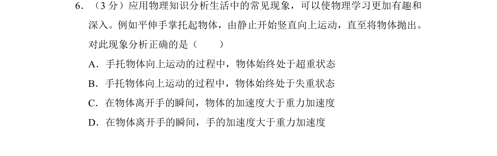
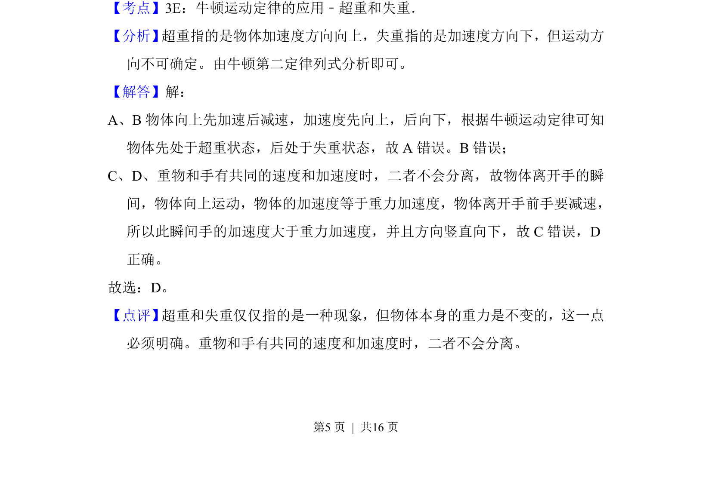

## 题面

## 摘要

手托物体竖直向上运动至抛出，分析超重失重状态及分离瞬间加速度关系。

## 关联考点

- [[超重和失重]]
- [[229-牛顿第二定律|牛顿第二定律]]
- [[物体分离条件]]

## 答案与解析

> 📄 原 PDF 第 5 页：`素材/真题/北京/2008-2024·（北京）物理高考真题/2014年高考物理试卷（北京）（解析卷）.pdf`

<!-- 题干文本-start -->
## 题干文本
6．（3分）应用物理知识分析生活中的常见现象，可以使物理学习更加有趣和
深入。例如平伸手掌托起物体，由静止开始竖直向上运动，直至将物体抛出。
对此现象分析正确的是（　　）
A．手托物体向上运动的过程中，物体始终处于超重状态
B．手托物体向上运动的过程中，物体始终处于失重状态
C．在物体离开手的瞬间，物体的加速度大于重力加速度
D．在物体离开手的瞬间，手的加速度大于重力加速度
<!-- 题干文本-end -->

<!-- 解析文本-start -->
## 解析文本
【考点】3E：牛顿运动定律的应用﹣超重和失重．菁优网版权所有
【分析】 超重指的是物体加速度方向向上，失重指的是加速度方向下，但运动方
向不可确定。由牛顿第二定律列式分析即可。
【解答】解：
A、B物体向上先加速后减速，加速度先向上，后向下，根据牛顿运动定律可知
物体先处于超重状态，后处于失重状态，故A错误。B错误；
C、D、重物和手有共同的速度和加速度时，二者不会分离，故物体离开手的瞬
间，物体向上运动，物体的加速度等于重力加速度，物体离开手前手要减速，
所以此瞬间手的加速度大于重力加速度，并且方向竖直向下，故C错误，D
正确。
故选：D。
【点评】 超重和失重仅仅指的是一种现象，但物体本身的重力是不变的，这一点
必须明确。重物和手有共同的速度和加速度时，二者不会分离。
<!-- 解析文本-end -->
