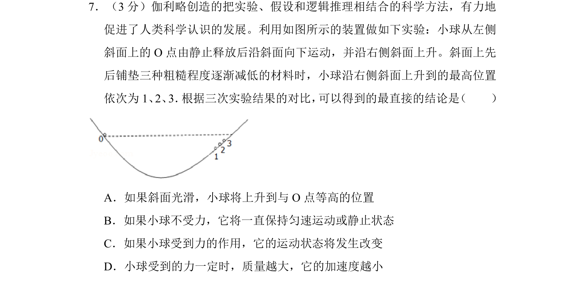
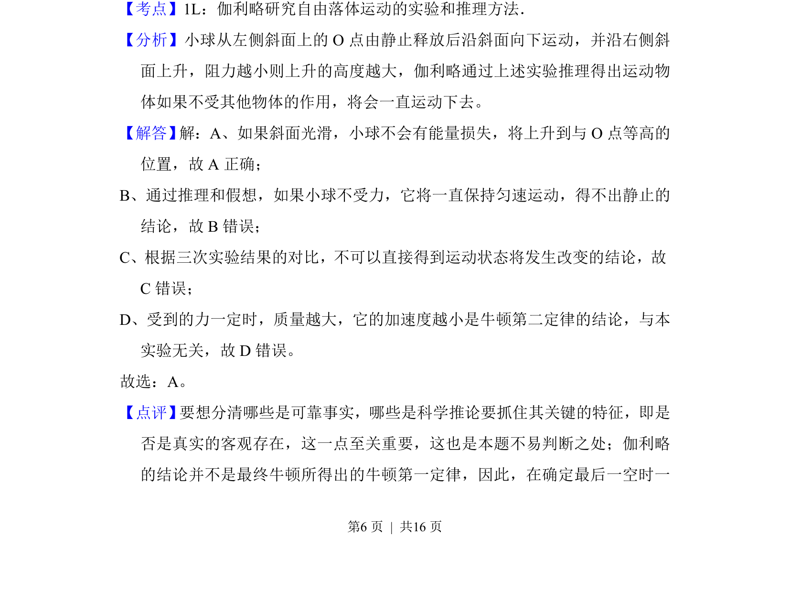

## 题面

## 摘要

该题通过伽利略斜面实验对比，考查逻辑推理与理想实验方法得出直接结论。

## 关联考点

- [[伽利略实验方法]]
- [[理想斜面]]
- [[037-推理|逻辑推理]]
- [[735-运动状态|运动状态]]

## 答案与解析

> 📄 原 PDF 第 6 页：`素材/真题/北京/2008-2024·（北京）物理高考真题/2014年高考物理试卷（北京）（解析卷）.pdf`
