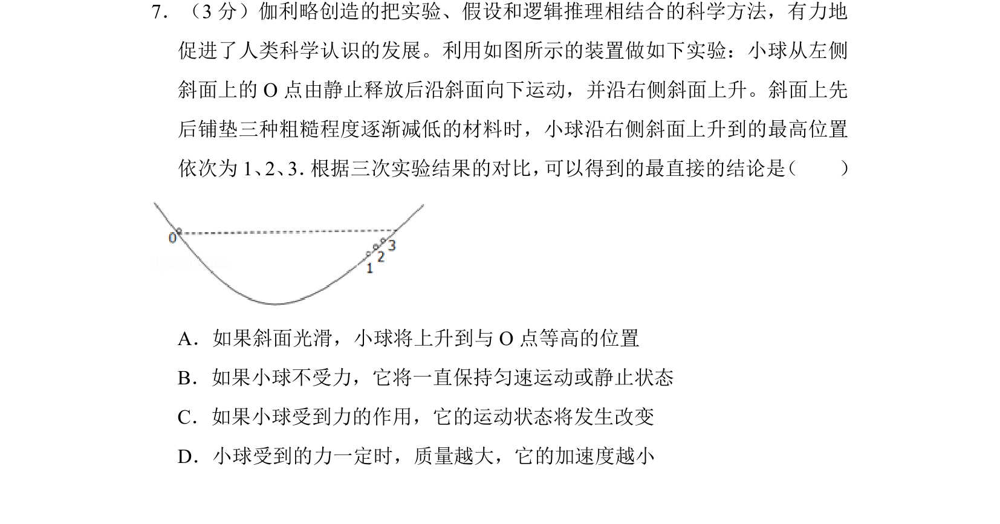
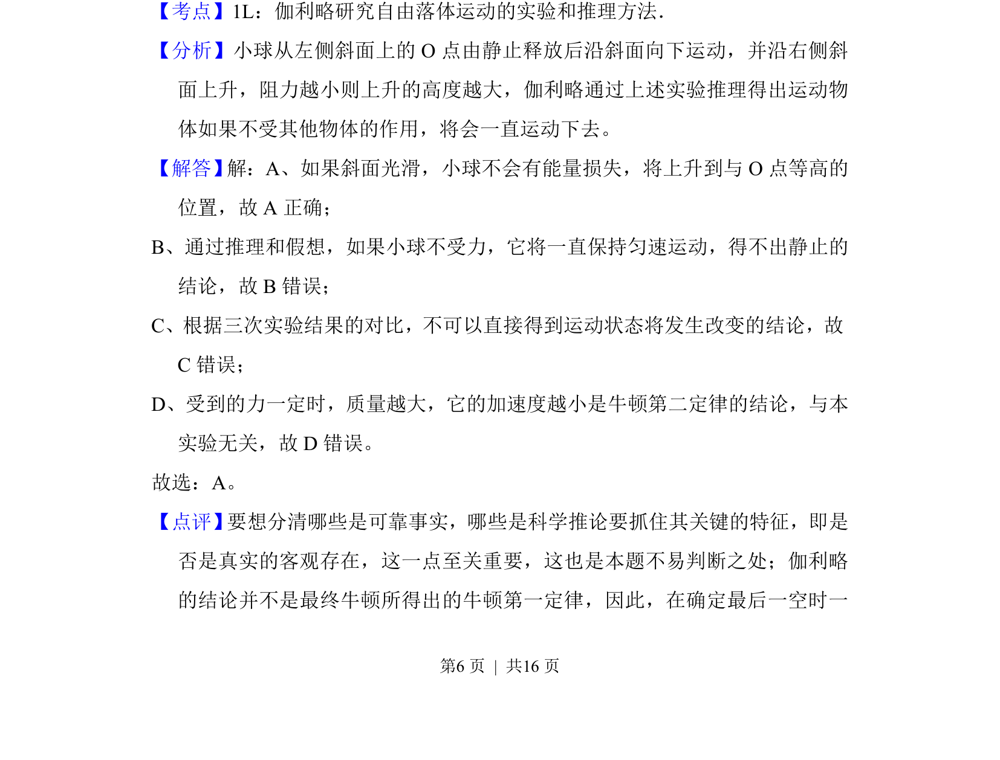

## 题面

## 摘要

该题通过伽利略斜面实验对比，考查逻辑推理与理想实验方法得出直接结论。

## 关联考点

- [[伽利略实验方法]]
- [[理想斜面]]
- [[037-推理|逻辑推理]]
- [[734-运动状态|运动状态]]

## 答案与解析

> 📄 原 PDF 第 6 页：`素材/真题/北京/2008-2024·（北京）物理高考真题/2014年高考物理试卷（北京）（解析卷）.pdf`

<!-- 题干文本-start -->
## 题干文本
7．（3分）伽利略创造的把实验、假设和逻辑推理相结合的科学方法，有力地
促进了人类科学认识的发展。利用如图所示的装置做如下实验：小球从左侧
斜面上的O点由静止释放后沿斜面向下运动，并沿右侧斜面上升。斜面上先
后铺垫三种粗糙程度逐渐减低的材料时，小球沿右侧斜面上升到的最高位置
依次为1、2、3． 根据三次实验结果的对比， 可以得到的最直接的结论是 （　　）
A．如果斜面光滑，小球将上升到与O点等高的位置
B．如果小球不受力，它将一直保持匀速运动或静止状态
C．如果小球受到力的作用，它的运动状态将发生改变
D．小球受到的力一定时，质量越大，它的加速度越小
<!-- 题干文本-end -->

<!-- 解析文本-start -->
## 解析文本
【考点】1L：伽利略研究自由落体运动的实验和推理方法．菁优网版权所有
【分析】小球从左侧斜面上的O点由静止释放后沿斜面向下运动，并沿右侧斜
面上升，阻力越小则上升的高度越大，伽利略通过上述实验推理得出运动物
体如果不受其他物体的作用，将会一直运动下去。
【解答】 解：A、如果斜面光滑，小球不会有能量损失，将上升到与O点等高的
位置，故A正确；
B、通过推理和假想，如果小球不受力，它将一直保持匀速运动，得不出静止的
结论，故B错误；
C、根据三次实验结果的对比，不可以直接得到运动状态将发生改变的结论，故
C错误；
D、受到的力一定时，质量越大，它的加速度越小是牛顿第二定律的结论，与本
实验无关，故D错误。
故选：A。
【点评】 要想分清哪些是可靠事实，哪些是科学推论要抓住其关键的特征，即是
否是真实的客观存在，这一点至关重要，这也是本题不易判断之处；伽利略
的结论并不是最终牛顿所得出的牛顿第一定律，因此，在确定最后一空时一
<!-- 解析文本-end -->
