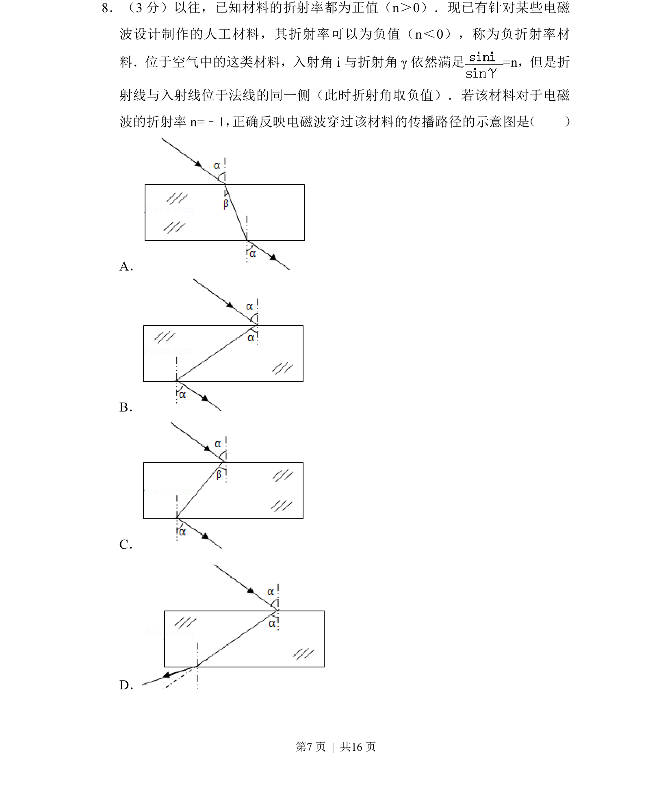
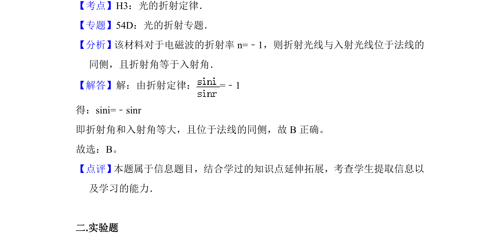

## 题面

## 摘要

考查负折射率材料的折射定律应用及光路作图，需根据 n=-1 判断折射光线方向。

## 关联考点

- [[026-折射定律|折射定律]]
- [[负折射率]]
- [[光路图]]

## 答案与解析

> 📄 原 PDF 第 7 页：`素材/真题/北京/2008-2024·（北京）物理高考真题/2014年高考物理试卷（北京）（解析卷）.pdf`

<!-- 题干文本-start -->
## 题干文本
8．（3分）以往，已知材料的折射率都为正值（n＞0）．现已有针对某些电磁
波设计制作的人工材料，其折射率可以为负值（n＜0），称为负折射率材
料．位于空气中的这类材料，入射角i与折射角γ依然满足=n，但是折
射线与入射线位于法线的同一侧（此时折射角取负值）．若该材料对于电磁
波的折射率n=﹣1， 正确反映电磁波穿过该材料的传播路径的示意图是 （　　）
A．
B．
C．
D．
<!-- 题干文本-end -->

<!-- 解析文本-start -->
## 解析文本

<!-- 解析文本-end -->
