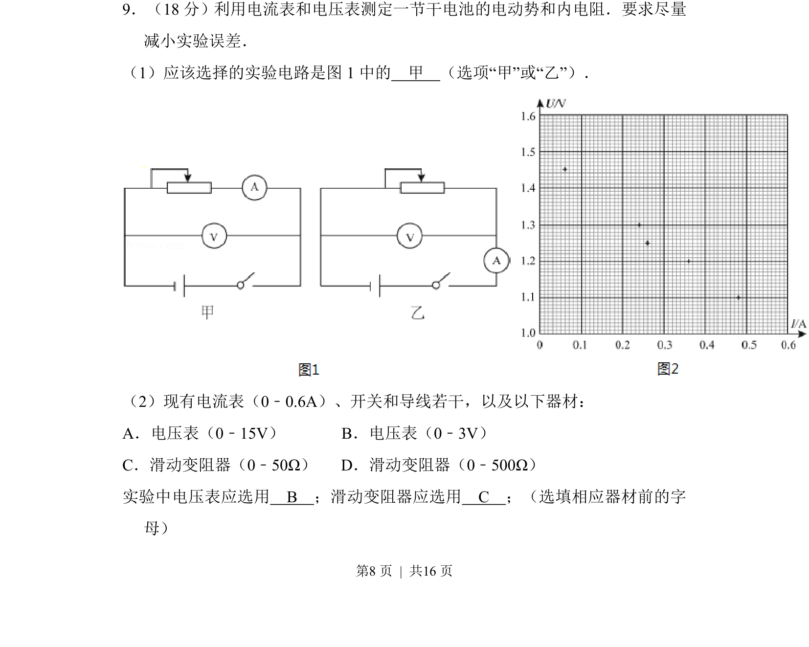
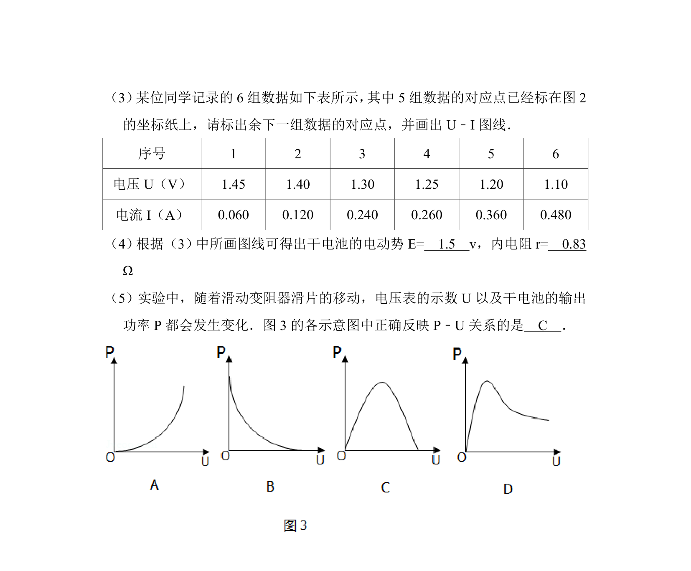
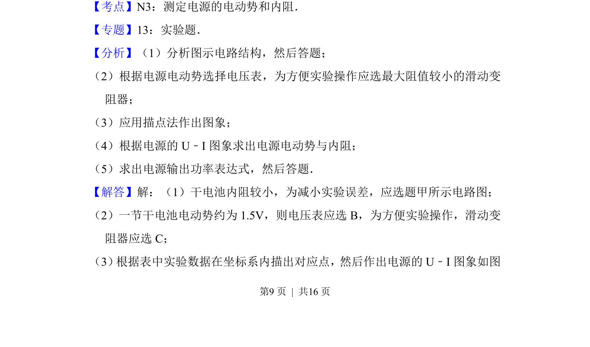
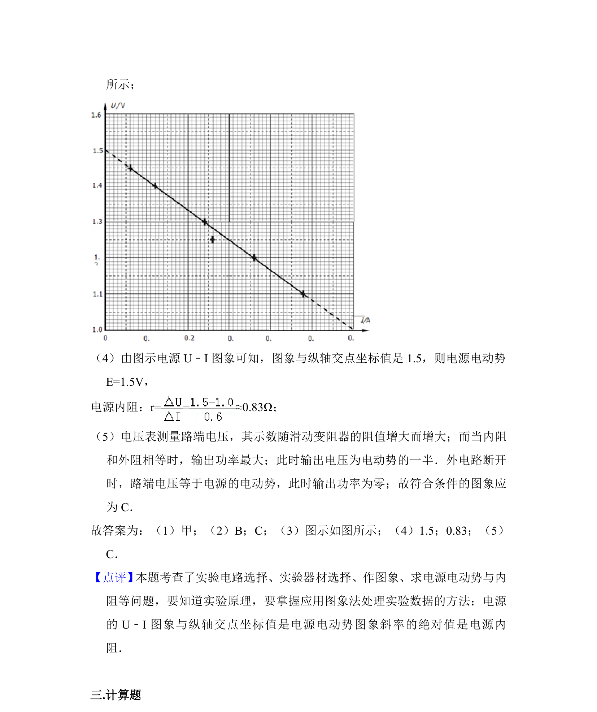

## 题面

## 摘要

测定干电池电动势和内阻的实验电路选择及器材选配。

## 关联考点

- [[实验电路选择]]
- [[电压表量程选择]]
- [[滑动变阻器选择]]

## 答案与解析

> 📄 原 PDF 第 8 页：`素材/真题/北京/2008-2024·（北京）物理高考真题/2014年高考物理试卷（北京）（解析卷）.pdf`

<!-- 题干文本-start -->
## 题干文本
9．（18分）利用电流表和电压表测定一节干电池的电动势和内电阻．要求尽量
减小实验误差．
（1）应该选择的实验电路是图1中的　甲　（选项“甲”或“乙”）．
（2）现有电流表（0﹣0.6A）、开关和导线若干，以及以下器材：
A．电压表（0﹣15V）       B．电压表（0﹣3V）
C．滑动变阻器（0﹣50Ω）   D．滑动变阻器（0﹣500Ω）
实验中电压表应选用　B　；滑动变阻器应选用　C　；（选填相应器材前的字
母）
<!-- 题干文本-end -->

<!-- 解析文本-start -->
## 解析文本

<!-- 解析文本-end -->
