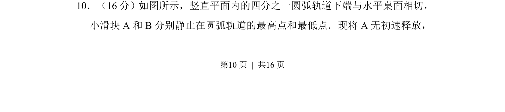
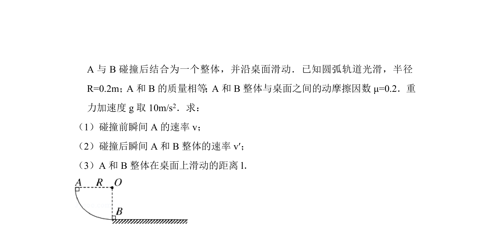
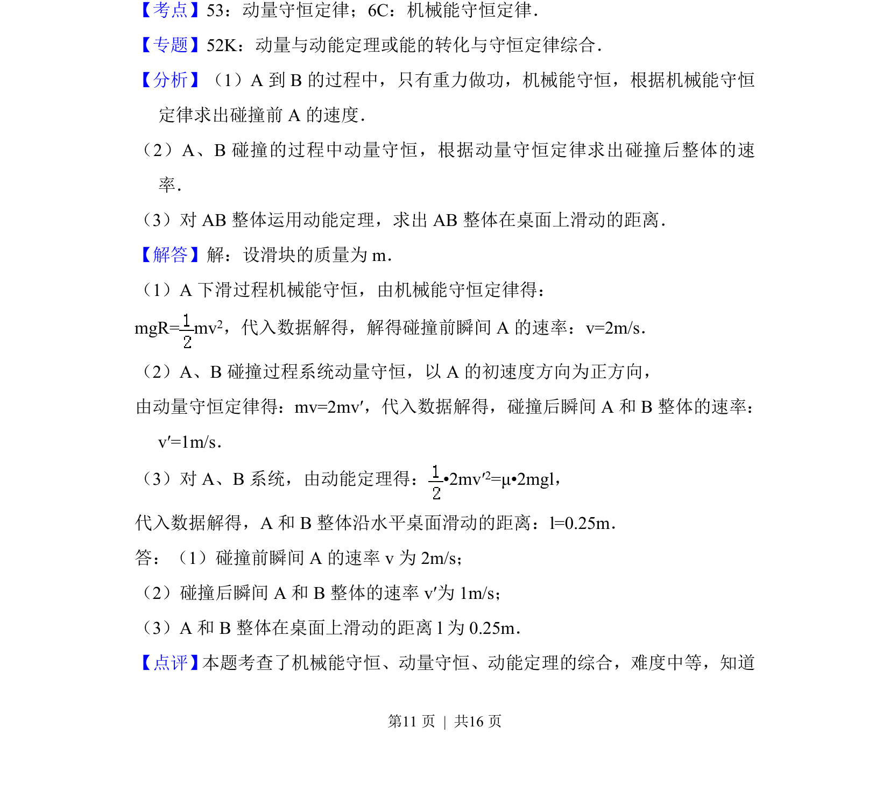
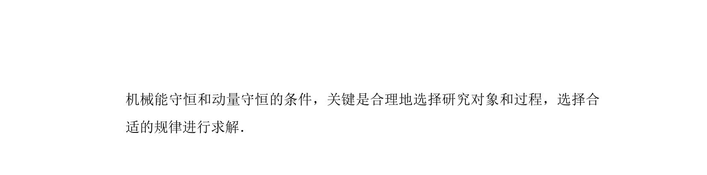

## 题面

## 摘要

小滑块A从圆弧轨道无初速释放，与B在水平段发生碰撞，考查机械能守恒、动量守恒及动能定理的应用。

## 关联考点

- [[085-机械能守恒-初中|机械能守恒]]
- [[539-动量守恒|动量守恒]]
- [[251-动能定理|动能定理]]
- [[372-碰撞|碰撞]]

## 答案与解析

> 📄 原 PDF 第 10 页：`素材/真题/北京/2008-2024·（北京）物理高考真题/2014年高考物理试卷（北京）（解析卷）.pdf`
