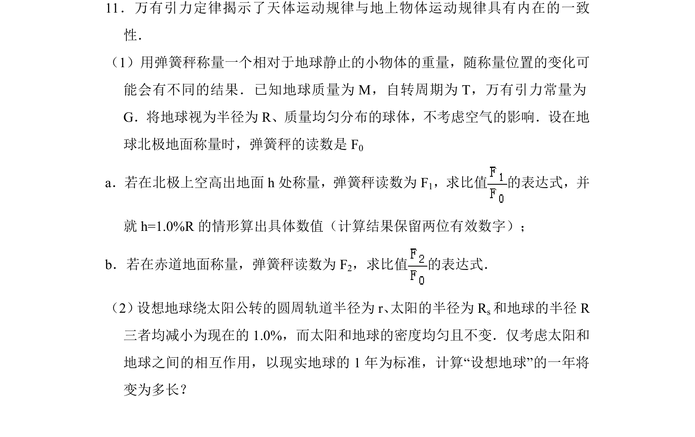
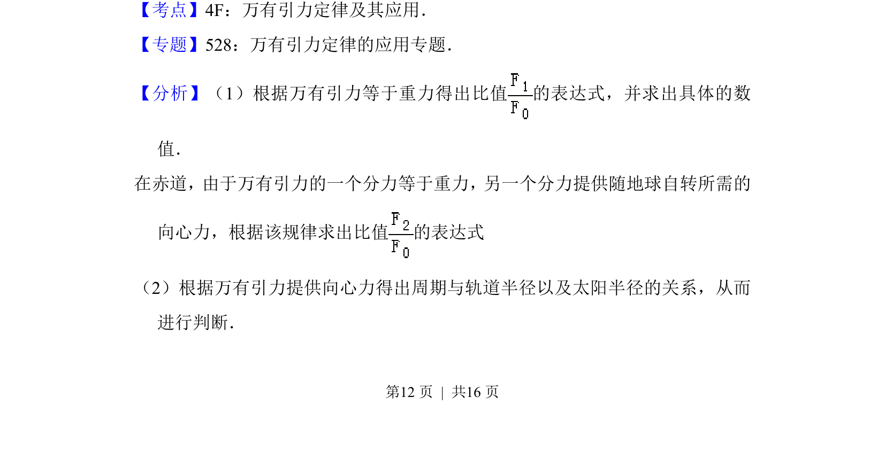
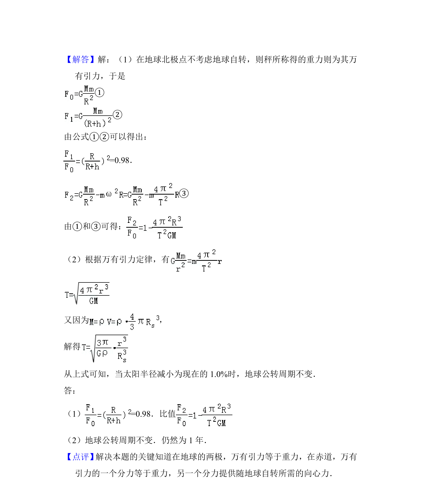

## 题面

## 摘要

本题通过弹簧秤称量地球不同位置物体重量和设想地球公转周期，考查万有引力定律与重力、向心力关系的综合应用。

## 关联考点

- [[246-万有引力定律|万有引力定律]]
- [[423-gravity-高中|重力]]
- [[256-向心力|向心力]]
- [[天体运动]]

## 答案与解析

> 📄 原 PDF 第 12 页：`素材/真题/北京/2008-2024·（北京）物理高考真题/2014年高考物理试卷（北京）（解析卷）.pdf`
