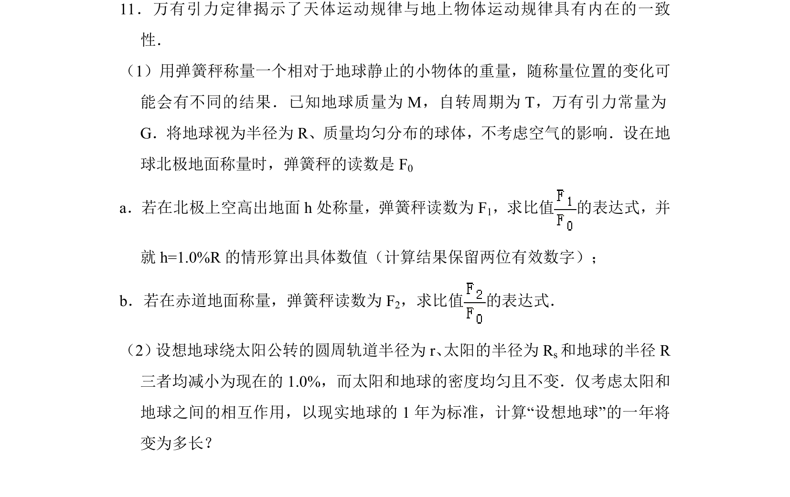
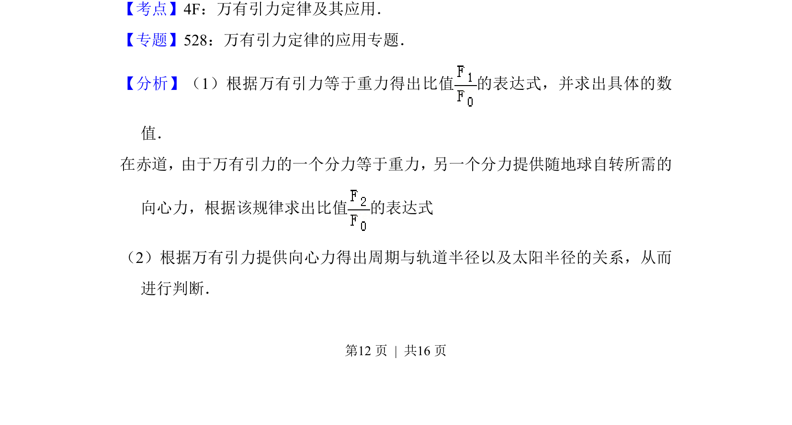
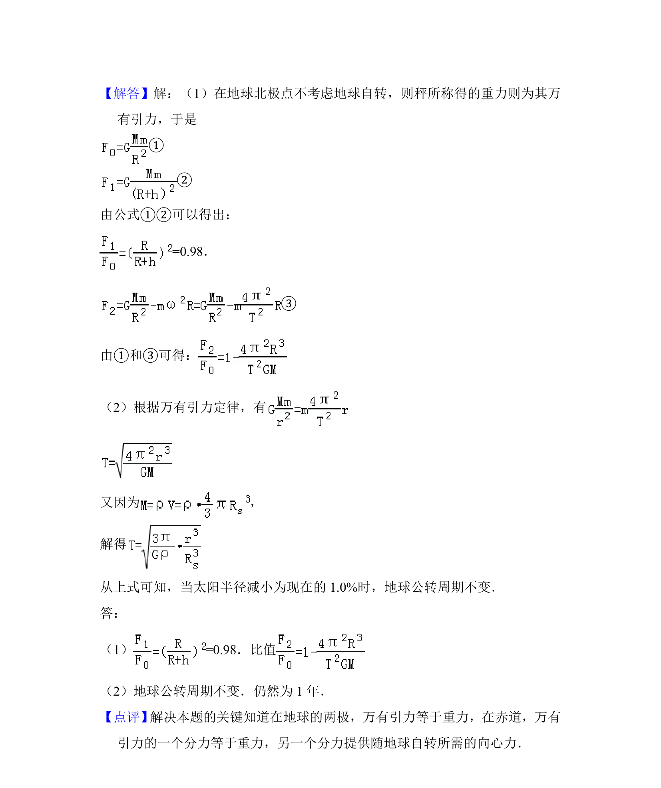

## 题面

## 摘要

本题通过弹簧秤称量地球不同位置物体重量和设想地球公转周期，考查万有引力定律与重力、向心力关系的综合应用。

## 关联考点

- [[246-万有引力定律|万有引力定律]]
- [[423-gravity-高中|重力]]
- [[256-向心力|向心力]]
- [[天体运动]]

## 答案与解析

> 📄 原 PDF 第 12 页：`素材/真题/北京/2008-2024·（北京）物理高考真题/2014年高考物理试卷（北京）（解析卷）.pdf`

<!-- 题干文本-start -->
## 题干文本
11．万有引力定律揭示了天体运动规律与地上物体运动规律具有内在的一致
性．
（1）用弹簧秤称量一个相对于地球静止的小物体的重量，随称量位置的变化可
能会有不同的结果．已知地球质量为M，自转周期为T，万有引力常量为
G．将地球视为半径为R、质量均匀分布的球体，不考虑空气的影响．设在地
球北极地面称量时，弹簧秤的读数是F 0
a．若在北极上空高出地面h处称量，弹簧秤读数为F 1，求比值 的表达式，并
就h=1.0%R的情形算出具体数值（计算结果保留两位有效数字）；
b．若在赤道地面称量，弹簧秤读数为F 2，求比值 的表达式．
（2） 设想地球绕太阳公转的圆周轨道半径为r、 太阳的半径为Rs和地球的半径R
三者均减小为现在的1.0%，而太阳和地球的密度均匀且不变．仅考虑太阳和
地球之间的相互作用，以现实地球的1年为标准，计算“设想地球”的一年将
变为多长？
<!-- 题干文本-end -->

<!-- 解析文本-start -->
## 解析文本
【考点】4F：万有引力定律及其应用．菁优网版权所有
【专题】528：万有引力定律的应用专题．
【分析】（1）根据万有引力等于重力得出比值 的表达式，并求出具体的数
值．
在赤道，由于万有引力的一个分力等于重力，另一个分力提供随地球自转所需的
向心力，根据该规律求出比值 的表达式
（2）根据万有引力提供向心力得出周期与轨道半径以及太阳半径的关系，从而
进行判断．
<!-- 解析文本-end -->
