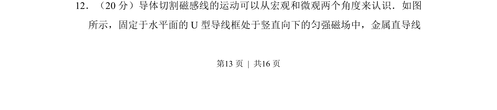
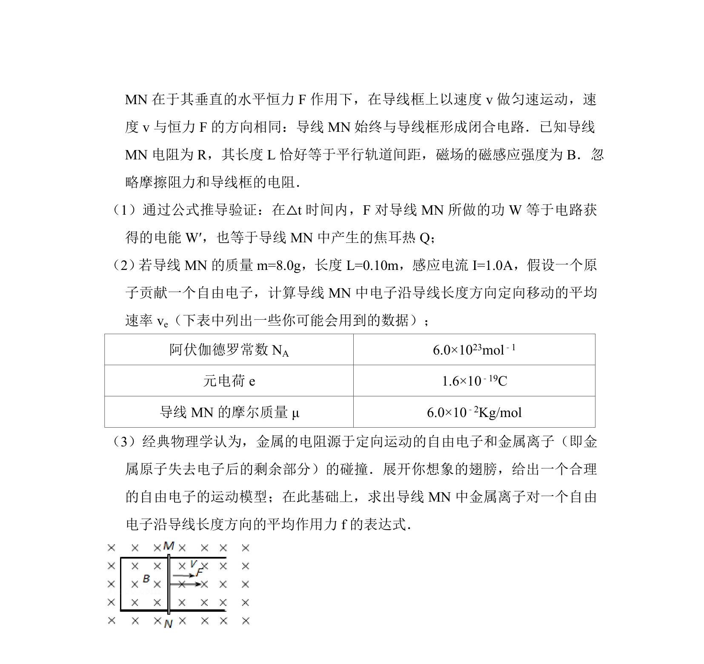
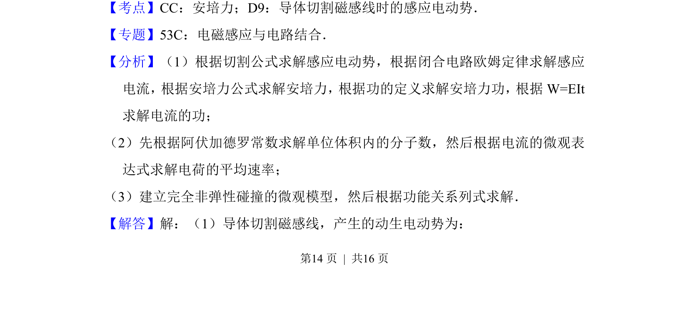
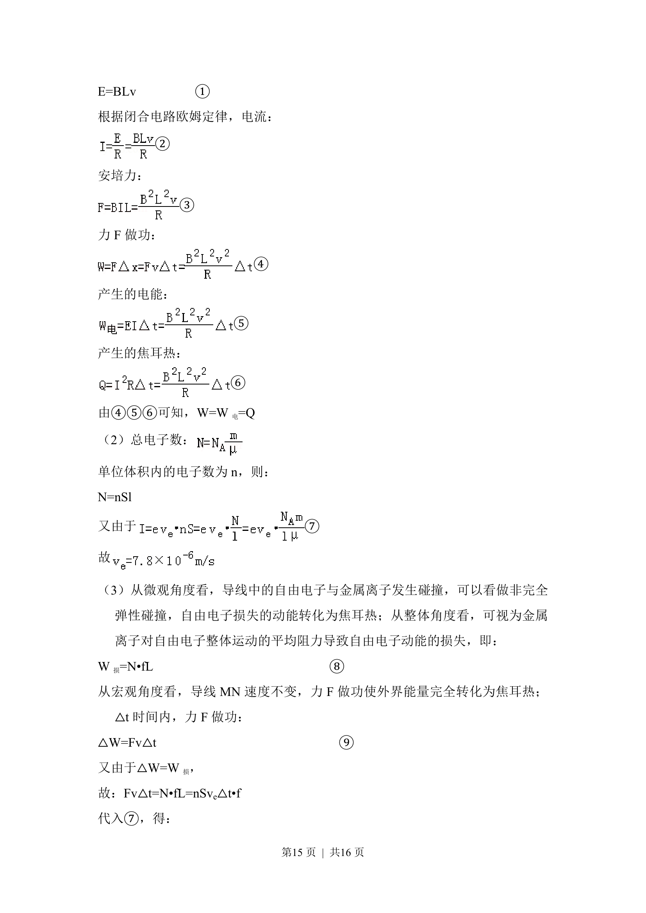
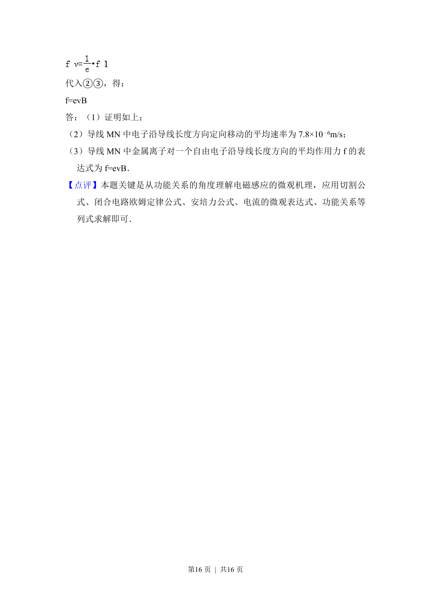

## 题面

## 摘要

导体棒切割磁感线时，从宏观动力学和微观电子受洛伦兹力两个角度分析能量转化与守恒。

## 关联考点

- [[175-电磁感应|电磁感应]]
- [[538-动生电动势|动生电动势]]
- [[安培力做功]]
- [[197-能量守恒定律|能量守恒]]

## 答案与解析

> 📄 原 PDF 第 13 页：`素材/真题/北京/2008-2024·（北京）物理高考真题/2014年高考物理试卷（北京）（解析卷）.pdf`
