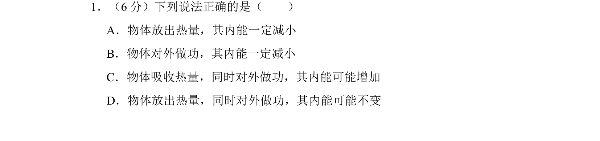
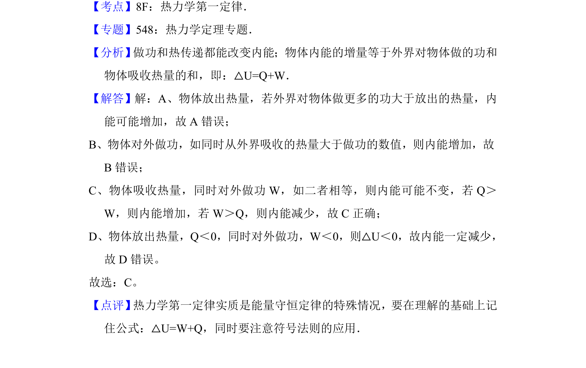

## 题面

## 摘要

考查热力学第一定律，通过热传递和做功判断内能变化。

## 关联考点

- [[440-热力学第一定律|热力学第一定律]]
- [[127-内能|内能]]
- [[248-功的定义-高中|做功]]
- [[150-热传递改变内能|热传递]]

## 答案与解析

> 📄 原 PDF 第 1 页：`素材/真题/北京/2008-2024·（北京）物理高考真题/2015年高考物理试卷（北京）（解析卷）.pdf`
