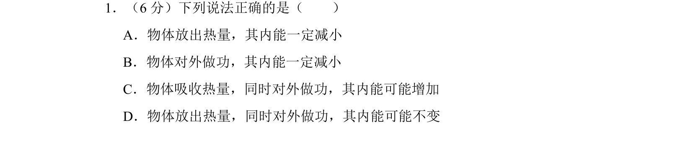
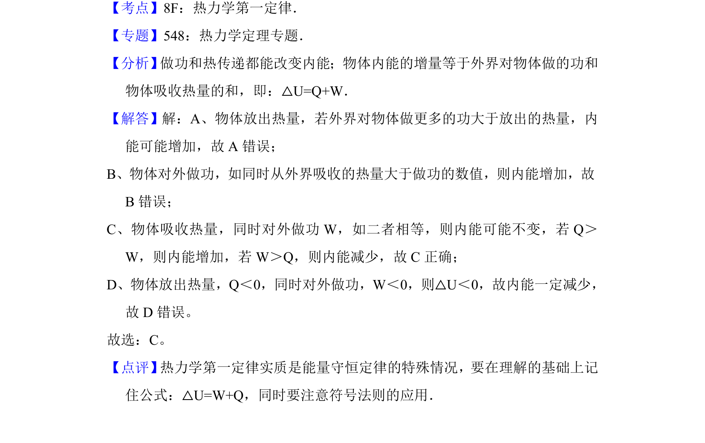

## 题面

## 摘要

考查热力学第一定律，通过热传递和做功判断内能变化。

## 关联考点

- [[440-热力学第一定律|热力学第一定律]]
- [[127-内能|内能]]
- [[248-功的定义-高中|做功]]
- [[150-热传递改变内能|热传递]]

## 答案与解析

> 📄 原 PDF 第 1 页：`素材/真题/北京/2008-2024·（北京）物理高考真题/2015年高考物理试卷（北京）（解析卷）.pdf`

<!-- 题干文本-start -->
## 题干文本
1．（6分）下列说法正确的是（　　）
A．物体放出热量，其内能一定减小
B．物体对外做功，其内能一定减小
C．物体吸收热量，同时对外做功，其内能可能增加
D．物体放出热量，同时对外做功，其内能可能不变
<!-- 题干文本-end -->

<!-- 解析文本-start -->
## 解析文本
【考点】8F：热力学第一定律．菁优网版权所有
【专题】548：热力学定理专题．
【分析】 做功和热传递都能改变内能；物体内能的增量等于外界对物体做的功和
物体吸收热量的和，即：△U=Q+W．
【解答】解：A、物体放出热量，若外界对物体做更多的功大于放出的热量，内
能可能增加，故A错误；
B、物体对外做功，如同时从外界吸收的热量大于做功的数值，则内能增加，故
B错误；
C、物体吸收热量，同时对外做功W，如二者相等，则内能可能不变，若Q＞
W，则内能增加，若W＞Q，则内能减少，故C正确；
D、物体放出热量，Q＜0，同时对外做功，W＜0，则△U＜0，故内能一定减少，
故D错误。
故选：C。
【点评】 热力学第一定律实质是能量守恒定律的特殊情况，要在理解的基础上记
住公式：△U=W+Q，同时要注意符号法则的应用．
<!-- 解析文本-end -->
