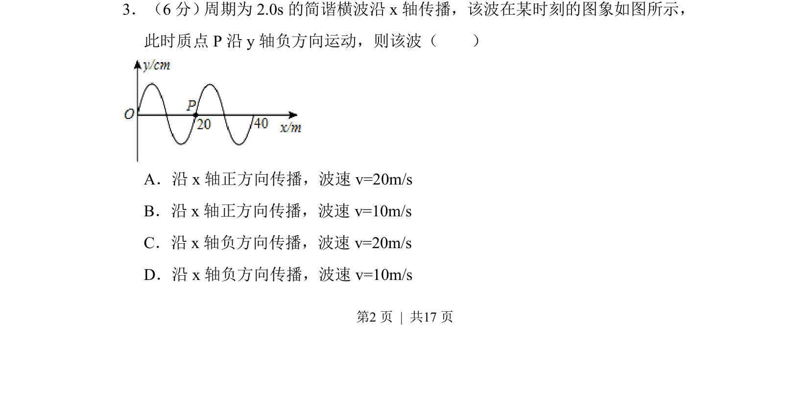
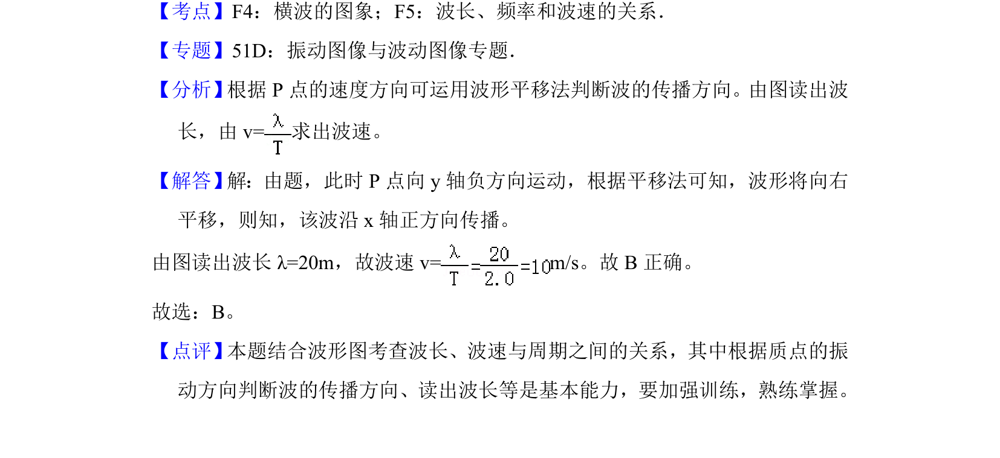

## 题面

## 摘要

根据波形图和质点振动方向判断简谐横波的传播方向并计算波速。

## 关联考点

- [[714-简谐横波|简谐横波]]
- [[365-波的图象|波形图]]
- [[波长波速周期关系]]
- [[765-质点振动方向|质点振动方向]]

## 答案与解析

> 📄 原 PDF 第 2 页：`素材/真题/北京/2008-2024·（北京）物理高考真题/2015年高考物理试卷（北京）（解析卷）.pdf`
