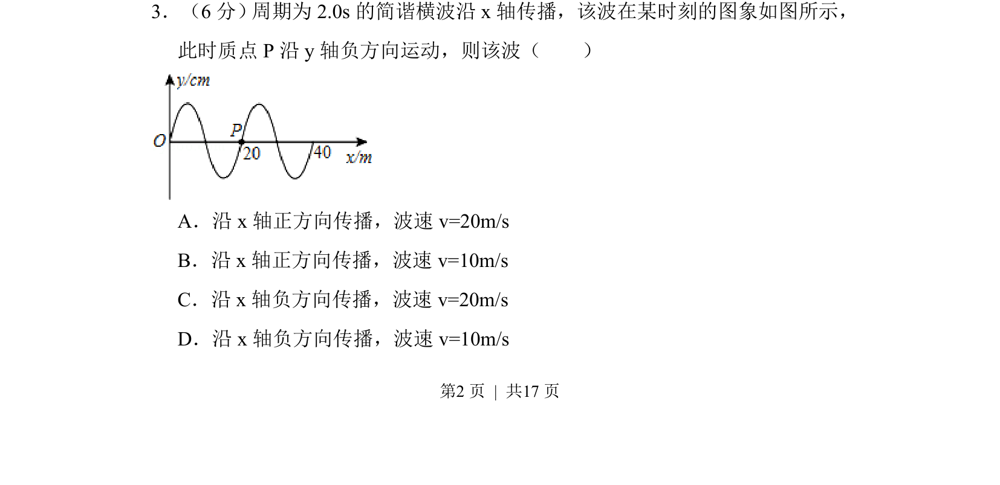
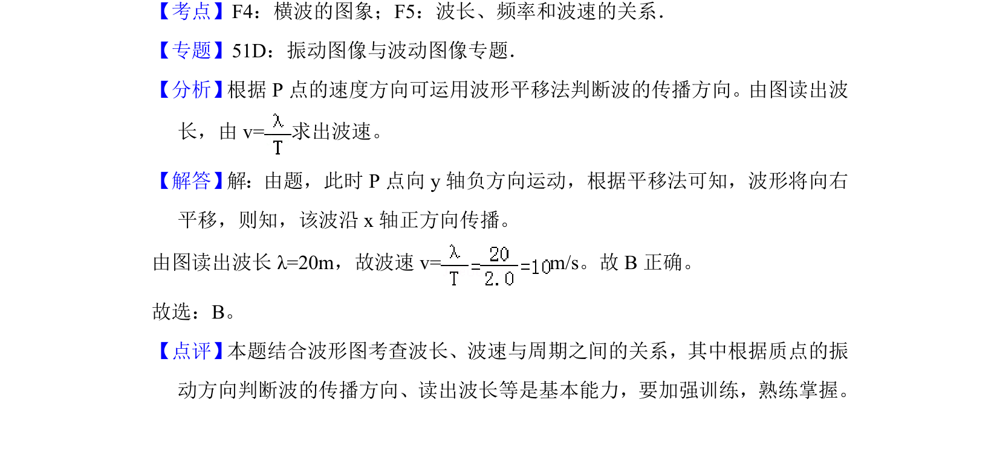

## 题面

## 摘要

根据波形图和质点振动方向判断简谐横波的传播方向并计算波速。

## 关联考点

- [[713-简谐横波|简谐横波]]
- [[365-波的图象|波形图]]
- [[波长波速周期关系]]
- [[764-质点振动方向|质点振动方向]]

## 答案与解析

> 📄 原 PDF 第 2 页：`素材/真题/北京/2008-2024·（北京）物理高考真题/2015年高考物理试卷（北京）（解析卷）.pdf`

<!-- 题干文本-start -->
## 题干文本
3．（6分） 周期为2.0s的简谐横波沿x轴传播，该波在某时刻的图象如图所示，
此时质点P沿y轴负方向运动，则该波（　　）
A．沿x轴正方向传播，波速v=20m/s
B．沿x轴正方向传播，波速v=10m/s
C．沿x轴负方向传播，波速v=20m/s
D．沿x轴负方向传播，波速v=10m/s
<!-- 题干文本-end -->

<!-- 解析文本-start -->
## 解析文本

<!-- 解析文本-end -->
