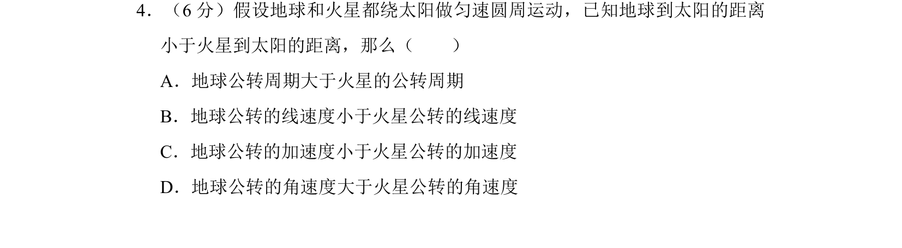
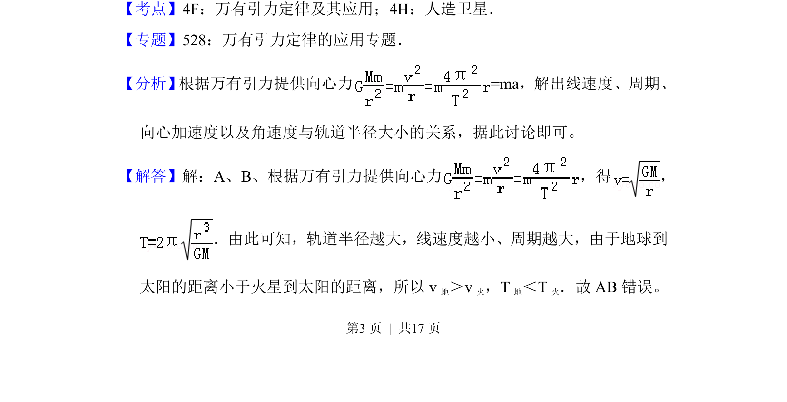
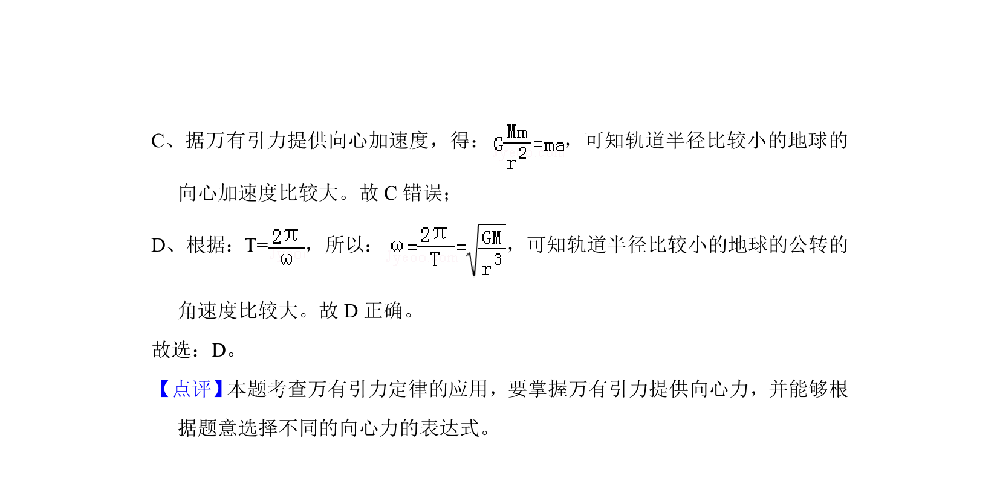

## 题面

## 摘要

地球和火星绕太阳公转，根据万有引力定律比较线速度、周期、加速度和角速度。

## 关联考点

- [[246-万有引力定律|万有引力定律]]
- [[253-匀速圆周运动|匀速圆周运动]]
- [[257-向心加速度|向心加速度]]
- [[286-角速度|角速度]]

## 答案与解析

> 📄 原 PDF 第 3 页：`素材/真题/北京/2008-2024·（北京）物理高考真题/2015年高考物理试卷（北京）（解析卷）.pdf`
