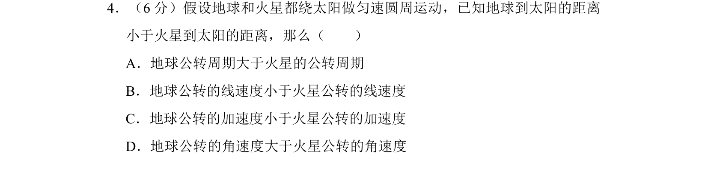
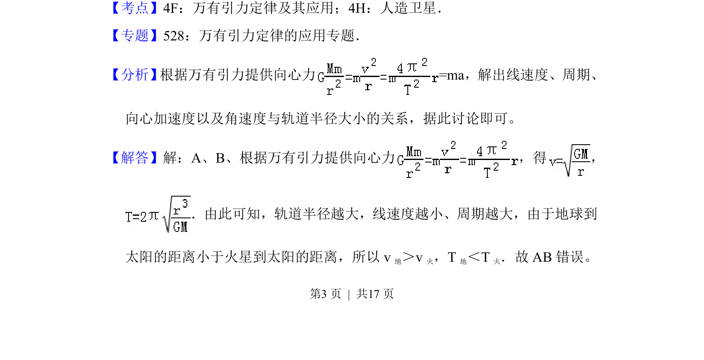
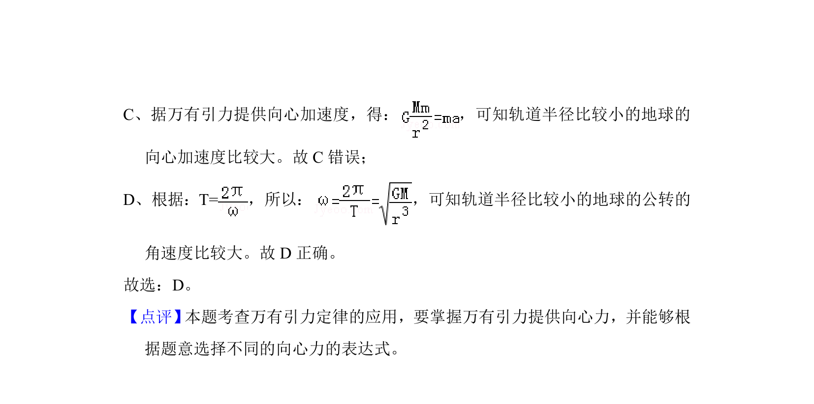

## 题面

## 摘要

地球和火星绕太阳公转，根据万有引力定律比较线速度、周期、加速度和角速度。

## 关联考点

- [[246-万有引力定律|万有引力定律]]
- [[253-匀速圆周运动|匀速圆周运动]]
- [[257-向心加速度|向心加速度]]
- [[286-角速度|角速度]]

## 答案与解析

> 📄 原 PDF 第 3 页：`素材/真题/北京/2008-2024·（北京）物理高考真题/2015年高考物理试卷（北京）（解析卷）.pdf`

<!-- 题干文本-start -->
## 题干文本
4．（6分）假设地球和火星都绕太阳做匀速圆周运动，已知地球到太阳的距离
小于火星到太阳的距离，那么（　　）
A．地球公转周期大于火星的公转周期
B．地球公转的线速度小于火星公转的线速度
C．地球公转的加速度小于火星公转的加速度
D．地球公转的角速度大于火星公转的角速度
<!-- 题干文本-end -->

<!-- 解析文本-start -->
## 解析文本
【考点】4F：万有引力定律及其应用；4H：人造卫星．菁优网版权所有
【专题】528：万有引力定律的应用专题．
【分析】 根据万有引力提供向心力=ma，解出线速度、周期、
向心加速度以及角速度与轨道半径大小的关系，据此讨论即可。
【解答】解：A、B、根据万有引力提供向心力 ，得 ，
．由此可知，轨道半径越大，线速度越小、周期越大，由于地球到
太阳的距离小于火星到太阳的距离，所以v 地＞v 火，T 地＜T 火．故AB错误。
<!-- 解析文本-end -->
