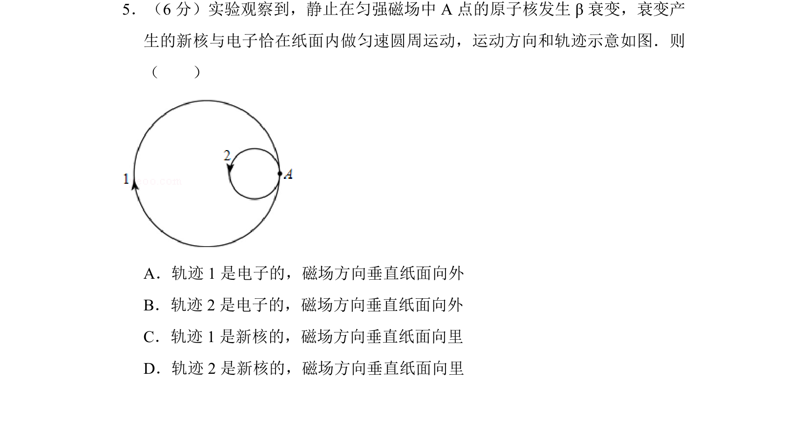
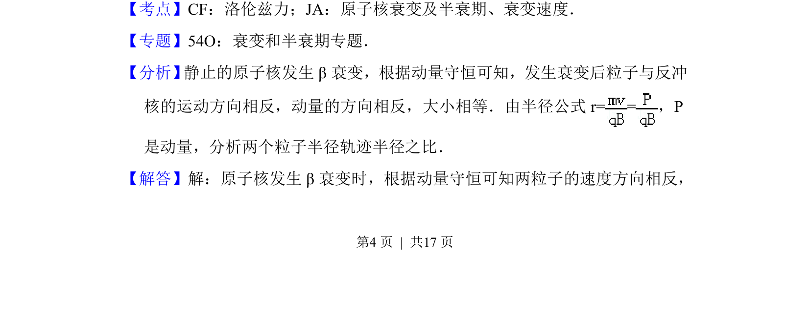
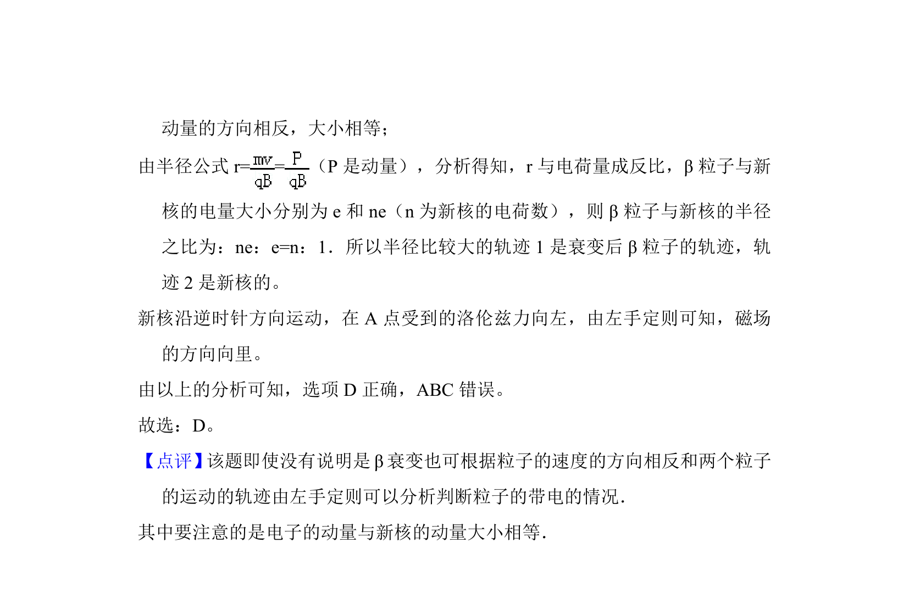

## 题面

## 摘要

考查β衰变中的动量守恒及带电粒子在磁场中的圆周运动轨迹判断

## 关联考点

- [[304-洛伦兹力|洛伦兹力]]
- [[原子核衰变]]
- [[539-动量守恒|动量守恒]]

## 答案与解析

> 📄 原 PDF 第 4 页：`素材/真题/北京/2008-2024·（北京）物理高考真题/2015年高考物理试卷（北京）（解析卷）.pdf`

<!-- 题干文本-start -->
## 题干文本
5．（6分）实验观察到，静止在匀强磁场中A点的原子核发生β衰变，衰变产
生的新核与电子恰在纸面内做匀速圆周运动，运动方向和轨迹示意如图．则
（　　）
A．轨迹1是电子的，磁场方向垂直纸面向外
B．轨迹2是电子的，磁场方向垂直纸面向外
C．轨迹1是新核的，磁场方向垂直纸面向里
D．轨迹2是新核的，磁场方向垂直纸面向里
<!-- 题干文本-end -->

<!-- 解析文本-start -->
## 解析文本
【考点】CF：洛伦兹力；JA：原子核衰变及半衰期、衰变速度．菁优网版权所有
【专题】54O：衰变和半衰期专题．
【分析】 静止的原子核发生β衰变，根据动量守恒可知，发生衰变后粒子与反冲
核的运动方向相反，动量的方向相反，大小相等．由半径公式r= =，P
是动量，分析两个粒子半径轨迹半径之比．
【解答】解：原子核发生β衰变时，根据动量守恒可知两粒子的速度方向相反，
<!-- 解析文本-end -->
