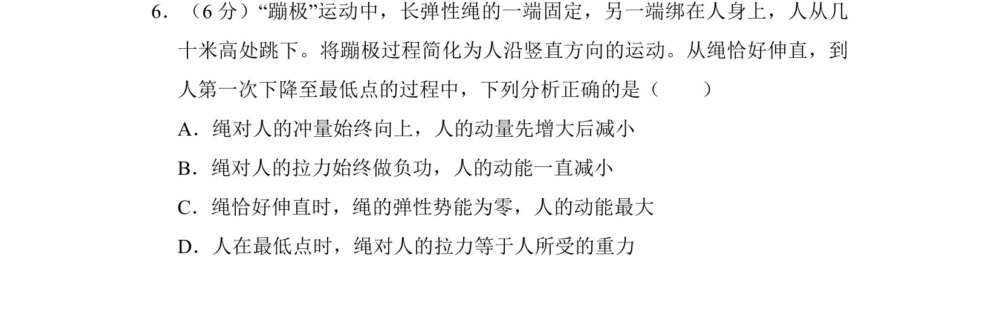
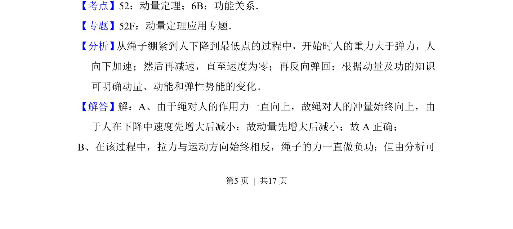
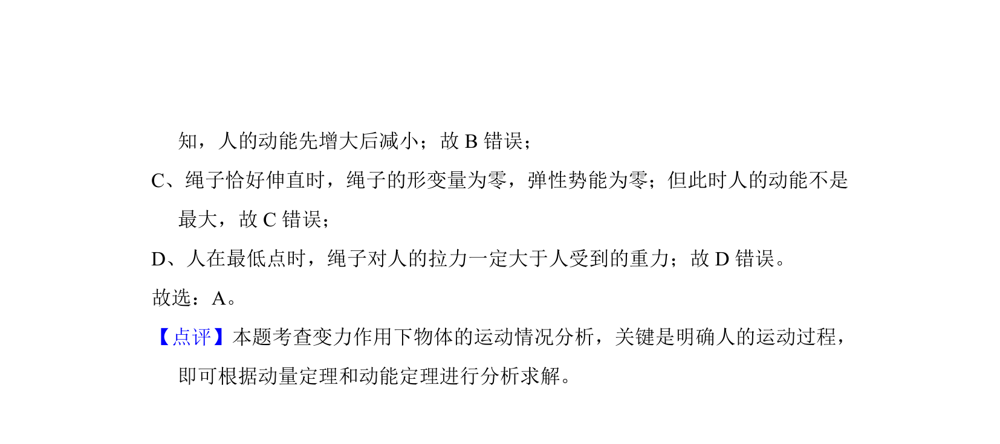

## 题面

## 摘要

人从绳伸直至最低点过程，分析冲量、功、动能、弹性势能等变化。

## 关联考点

- [[349-动量定理|动量定理]]
- [[249-功能关系|功能关系]]
- [[251-动能定理|动能定理]]
- [[变力做功]]

## 答案与解析

> 📄 原 PDF 第 5 页：`素材/真题/北京/2008-2024·（北京）物理高考真题/2015年高考物理试卷（北京）（解析卷）.pdf`
