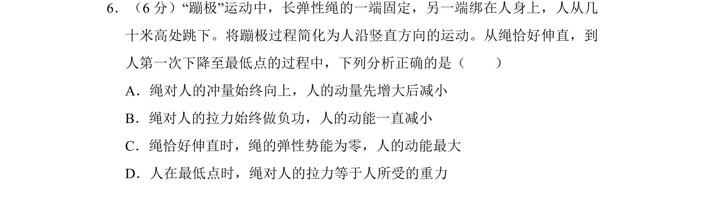
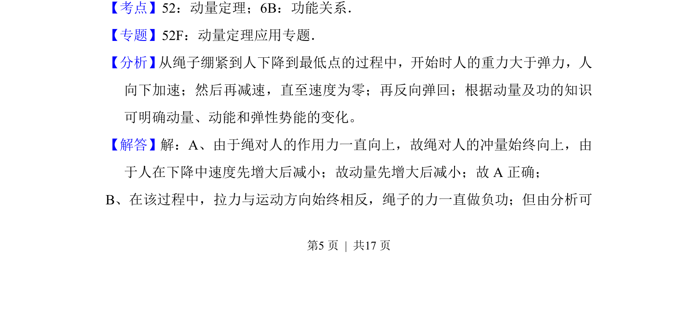
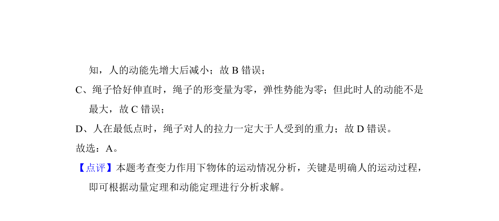

## 题面

## 摘要

人从绳伸直至最低点过程，分析冲量、功、动能、弹性势能等变化。

## 关联考点

- [[349-动量定理|动量定理]]
- [[249-功能关系|功能关系]]
- [[251-动能定理|动能定理]]
- [[变力做功]]

## 答案与解析

> 📄 原 PDF 第 5 页：`素材/真题/北京/2008-2024·（北京）物理高考真题/2015年高考物理试卷（北京）（解析卷）.pdf`

<!-- 题干文本-start -->
## 题干文本
6．（6分）“蹦极”运动中，长弹性绳的一端固定，另一端绑在人身上，人从几
十米高处跳下。将蹦极过程简化为人沿竖直方向的运动。从绳恰好伸直，到
人第一次下降至最低点的过程中，下列分析正确的是（　　）
A．绳对人的冲量始终向上，人的动量先增大后减小
B．绳对人的拉力始终做负功，人的动能一直减小
C．绳恰好伸直时，绳的弹性势能为零，人的动能最大
D．人在最低点时，绳对人的拉力等于人所受的重力
<!-- 题干文本-end -->

<!-- 解析文本-start -->
## 解析文本
【考点】52：动量定理；6B：功能关系．菁优网版权所有
【专题】52F：动量定理应用专题．
【分析】 从绳子绷紧到人下降到最低点的过程中，开始时人的重力大于弹力，人
向下加速；然后再减速，直至速度为零；再反向弹回；根据动量及功的知识
可明确动量、动能和弹性势能的变化。
【解答】解：A、由于绳对人的作用力一直向上，故绳对人的冲量始终向上，由
于人在下降中速度先增大后减小；故动量先增大后减小；故A正确；
B、在该过程中，拉力与运动方向始终相反，绳子的力一直做负功；但由分析可
<!-- 解析文本-end -->
