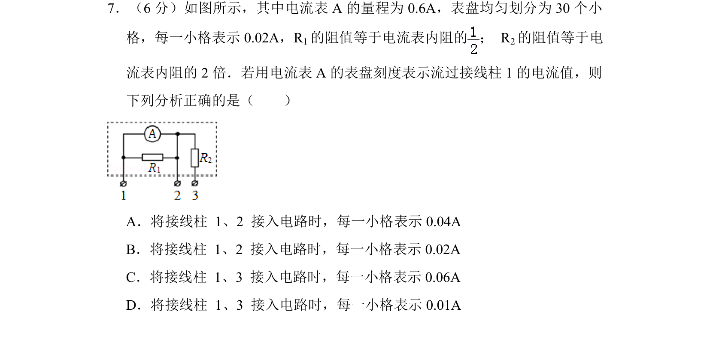
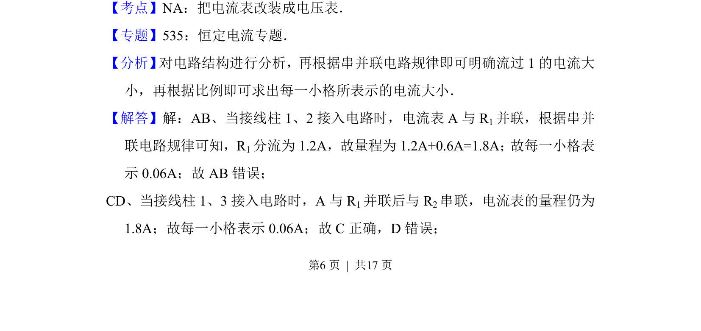
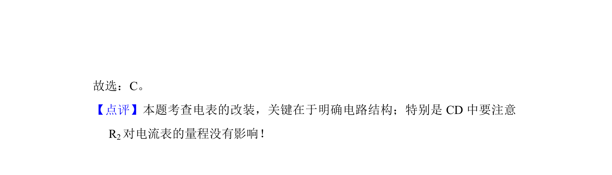

## 题面

## 摘要

该题考查电流表改装及多量程接入方式下的电流计算，通过串并联电路分析确定每小格表示的电流值。

## 关联考点

- [[684-电流表改装|电流表改装]]
- [[串并联电路规律]]
- [[862-并联分流|分流原理]]
- [[694-电路分析|电路分析]]

## 答案与解析

> 📄 原 PDF 第 6 页：`素材/真题/北京/2008-2024·（北京）物理高考真题/2015年高考物理试卷（北京）（解析卷）.pdf`
