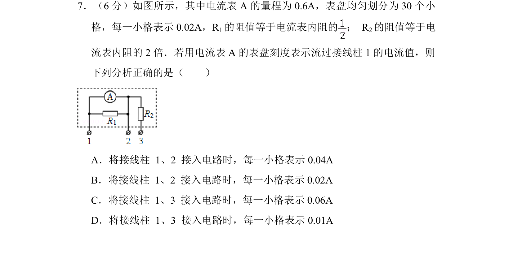
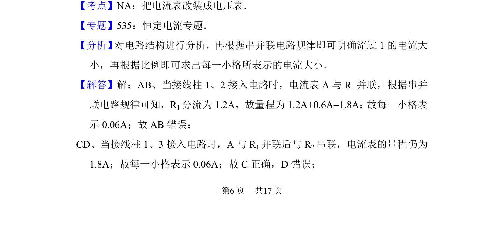
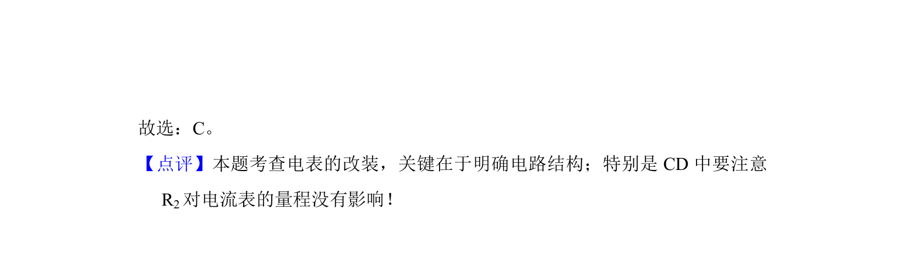

## 题面

## 摘要

该题考查电流表改装及多量程接入方式下的电流计算，通过串并联电路分析确定每小格表示的电流值。

## 关联考点

- [[683-电流表改装|电流表改装]]
- [[串并联电路规律]]
- [[862-并联分流|分流原理]]
- [[693-电路分析|电路分析]]

## 答案与解析

> 📄 原 PDF 第 6 页：`素材/真题/北京/2008-2024·（北京）物理高考真题/2015年高考物理试卷（北京）（解析卷）.pdf`

<!-- 题干文本-start -->
## 题干文本
7．（6分）如图所示，其中电流表A的量程为0.6A，表盘均匀划分为30个小
格，每一小格表示0.02A，R 1的阻值等于电流表内阻的 ； R 2的阻值等于电
流表内阻的2倍．若用电流表A的表盘刻度表示流过接线柱1的电流值，则
下列分析正确的是（　　）
A．将接线柱 1、2 接入电路时，每一小格表示0.04A
B．将接线柱 1、2 接入电路时，每一小格表示0.02A
C．将接线柱 1、3 接入电路时，每一小格表示0.06A
D．将接线柱 1、3 接入电路时，每一小格表示0.01A
<!-- 题干文本-end -->

<!-- 解析文本-start -->
## 解析文本
【考点】NA：把电流表改装成电压表．菁优网版权所有
【专题】535：恒定电流专题．
【分析】 对电路结构进行分析，再根据串并联电路规律即可明确流过1的电流大
小，再根据比例即可求出每一小格所表示的电流大小．
【解答】解：AB、当接线柱1、2接入电路时，电流表A与R 1并联，根据串并
联电路规律可知，R1分流为1.2A，故量程为1.2A+0.6A=1.8A； 故每一小格表
示0.06A；故AB错误；
CD、当接线柱1、3接入电路时，A与R 1并联后与R 2串联，电流表的量程仍为
1.8A；故每一小格表示0.06A；故C正确，D错误；
<!-- 解析文本-end -->
