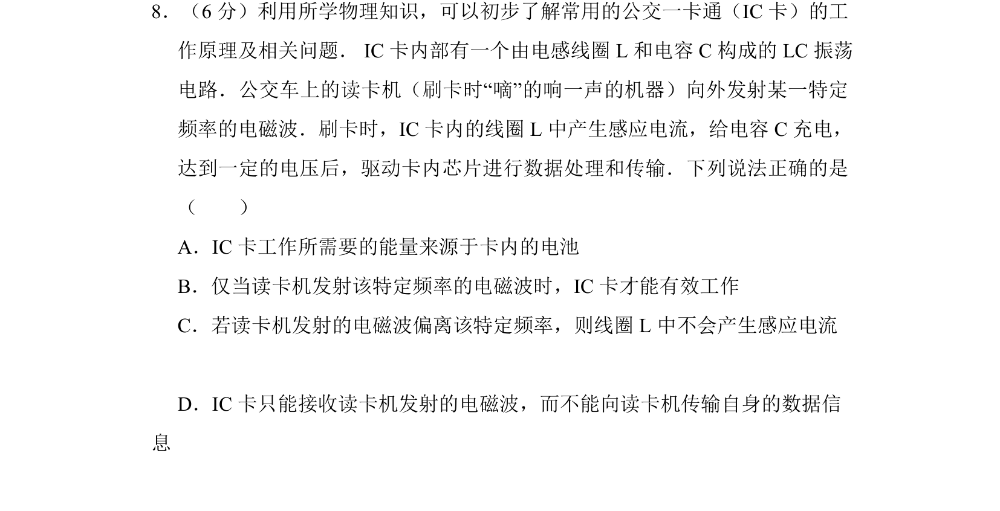
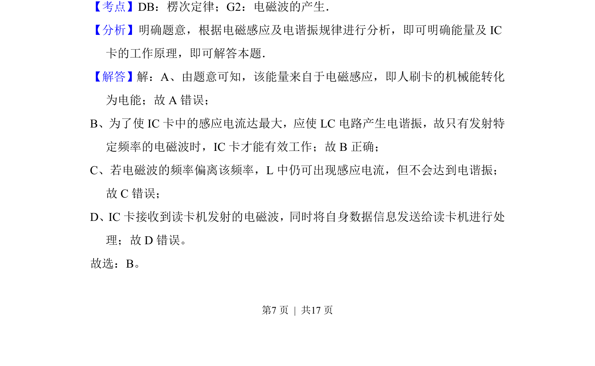
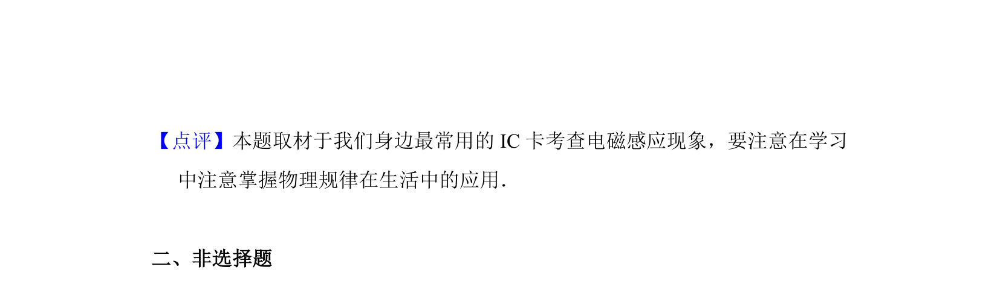

## 题面

## 摘要

IC卡利用电磁感应和LC振荡电路的电谐振原理工作，需特定频率电磁波才能有效工作。

## 关联考点

- [[175-电磁感应|电磁感应]]
- [[电谐振]]
- [[376-LC振荡电路|LC振荡电路]]

## 答案与解析

> 📄 原 PDF 第 7 页：`素材/真题/北京/2008-2024·（北京）物理高考真题/2015年高考物理试卷（北京）（解析卷）.pdf`
