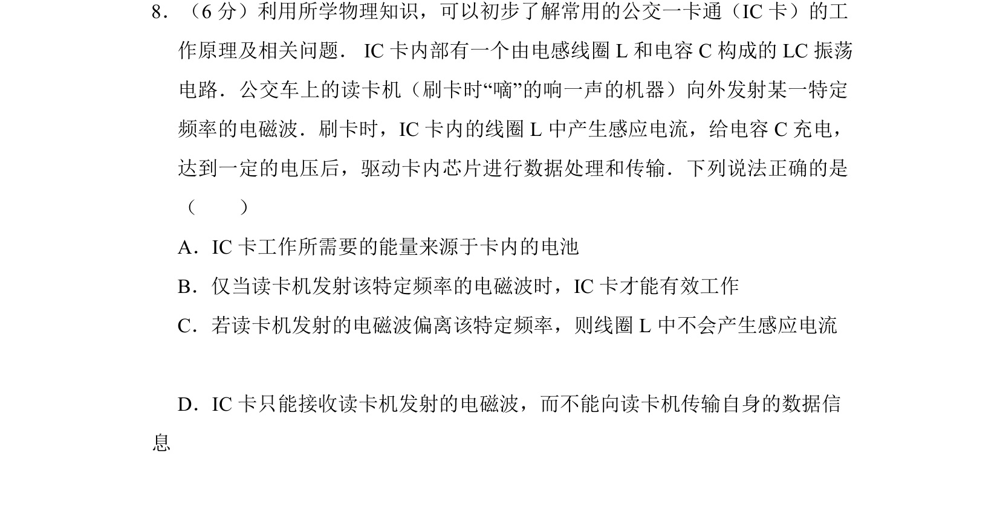
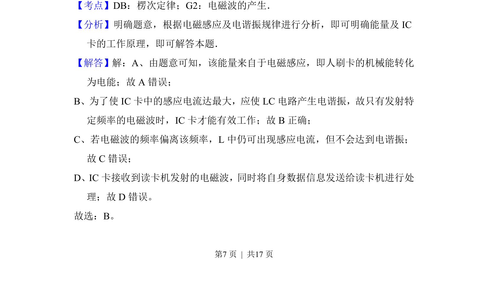

## 题面

## 摘要

IC卡利用电磁感应和LC振荡电路的电谐振原理工作，需特定频率电磁波才能有效工作。

## 关联考点

- [[175-电磁感应|电磁感应]]
- [[电谐振]]
- [[376-LC振荡电路|LC振荡电路]]

## 答案与解析

> 📄 原 PDF 第 7 页：`素材/真题/北京/2008-2024·（北京）物理高考真题/2015年高考物理试卷（北京）（解析卷）.pdf`

<!-- 题干文本-start -->
## 题干文本
8．（6分）利用所学物理知识，可以初步了解常用的公交一卡通（IC卡）的工
作原理及相关问题． IC卡内部有一个由电感线圈L和电容C构成的LC振荡
电路．公交车上的读卡机（刷卡时“嘀”的响一声的机器）向外发射某一特定
频率的电磁波．刷卡时，IC卡内的线圈L中产生感应电流，给电容C充电，
达到一定的电压后，驱动卡内芯片进行数据处理和传输．下列说法正确的是
（　　）
A．IC卡工作所需要的能量来源于卡内的电池
B．仅当读卡机发射该特定频率的电磁波时，IC卡才能有效工作
C．若读卡机发射的电磁波偏离该特定频率，则线圈L中不会产生感应电流
D．IC卡只能接收读卡机发射的电磁波，而不能向读卡机传输自身的数据信
息
<!-- 题干文本-end -->

<!-- 解析文本-start -->
## 解析文本
【考点】DB：楞次定律；G2：电磁波的产生．菁优网版权所有
【分析】明确题意，根据电磁感应及电谐振规律进行分析，即可明确能量及IC
卡的工作原理，即可解答本题．
【解答】解：A、由题意可知，该能量来自于电磁感应，即人刷卡的机械能转化
为电能；故A错误；
B、为了使IC卡中的感应电流达最大，应使LC电路产生电谐振，故只有发射特
定频率的电磁波时，IC卡才能有效工作；故B正确；
C、若电磁波的频率偏离该频率，L中仍可出现感应电流，但不会达到电谐振；
故C错误；
D、IC卡接收到读卡机发射的电磁波，同时将自身数据信息发送给读卡机进行处
理；故D错误。
故选：B。
<!-- 解析文本-end -->
