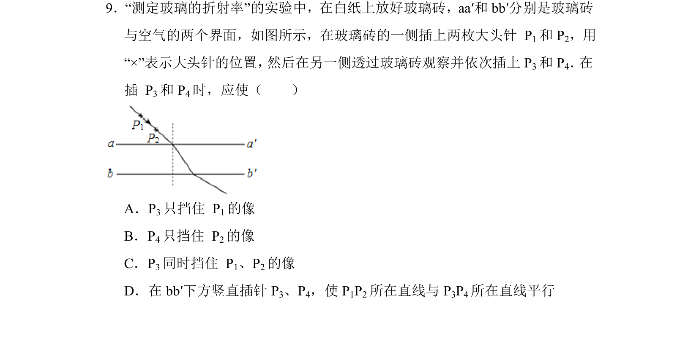
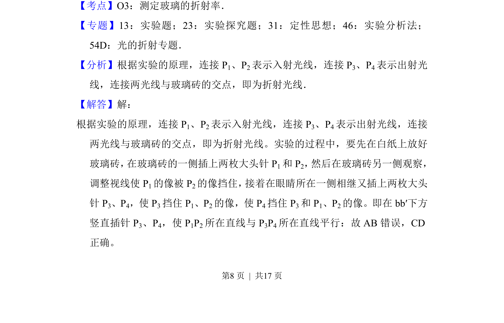
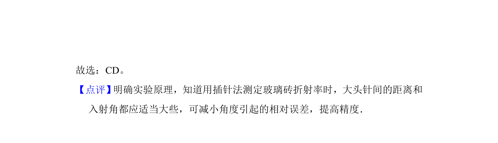

## 题面

## 摘要

考查测定玻璃折射率实验中大头针的插放方法与原理。

## 关联考点

- [[测定玻璃的折射率]]
- [[580-实验操作|实验操作]]
- [[插针法]]
- [[光路确定]]

## 答案与解析

> 📄 原 PDF 第 8 页：`素材/真题/北京/2008-2024·（北京）物理高考真题/2015年高考物理试卷（北京）（解析卷）.pdf`

<!-- 题干文本-start -->
## 题干文本
9．“测定玻璃的折射率”的实验中，在白纸上放好玻璃砖，aa′和bb′分别是玻璃砖
与空气的两个界面，如图所示，在玻璃砖的一侧插上两枚大头针 P 1和P 2，用
“×”表示大头针的位置， 然后在另一侧透过玻璃砖观察并依次插上P3和P 4． 在
插 P 3和P 4时，应使（　　）
A．P3只挡住 P 1的像
B．P4只挡住 P 2的像
C．P3同时挡住 P 1、P2的像
D．在bb′下方竖直插针P 3、P4，使P 1P2所在直线与P 3P4所在直线平行
<!-- 题干文本-end -->

<!-- 解析文本-start -->
## 解析文本
【考点】O3：测定玻璃的折射率．菁优网版权所有
【专题】13：实验题；23：实验探究题；31：定性思想；46：实验分析法；
54D：光的折射专题．
【分析】根据实验的原理，连接P 1、P2表示入射光线，连接P 3、P4表示出射光
线，连接两光线与玻璃砖的交点，即为折射光线．
【解答】解：
根据实验的原理，连接P 1、P2表示入射光线，连接P 3、P4表示出射光线，连接
两光线与玻璃砖的交点，即为折射光线。实验的过程中，要先在白纸上放好
玻璃砖， 在玻璃砖的一侧插上两枚大头针P1和P 2， 然后在玻璃砖另一侧观察，
调整视线使P 1的像被P 2的像挡住， 接着在眼睛所在一侧相继又插上两枚大头
针P 3、P4，使P 3挡住P 1、P2的像，使P 4挡住P 3和P 1、P2的像。即在bb′下方
竖直插针P 3、P4，使P 1P2所在直线与P 3P4所在直线平行：故AB错误，CD
正确。
<!-- 解析文本-end -->
