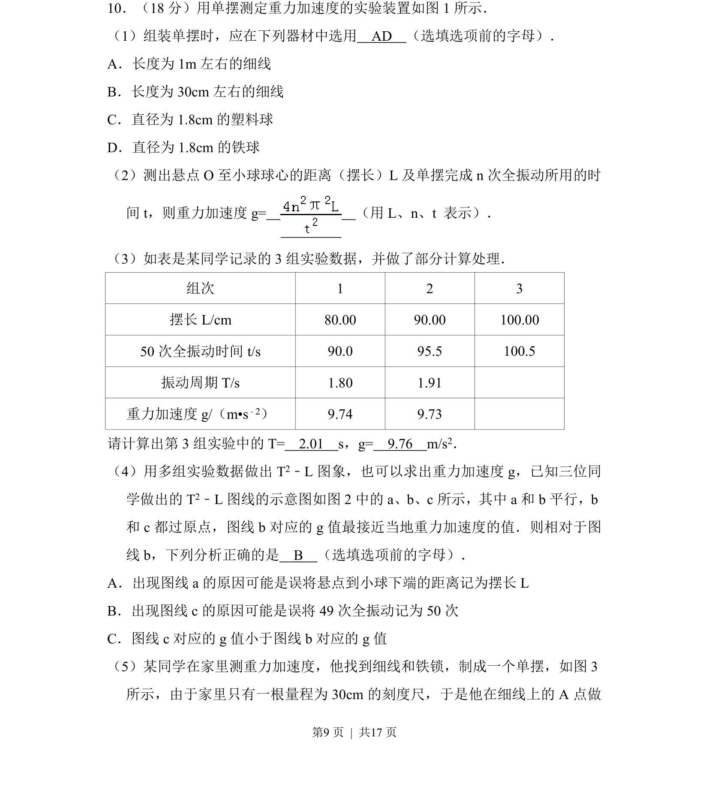
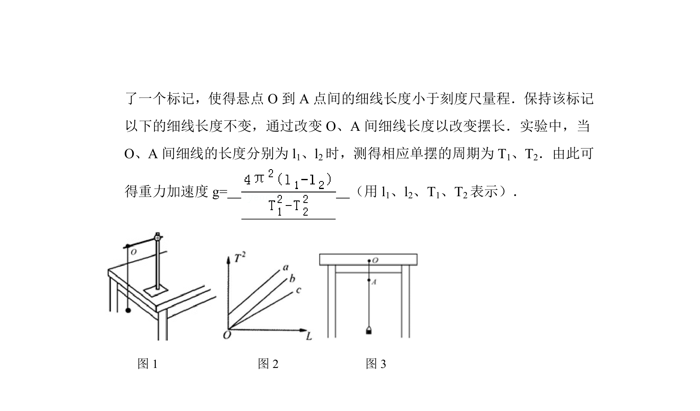
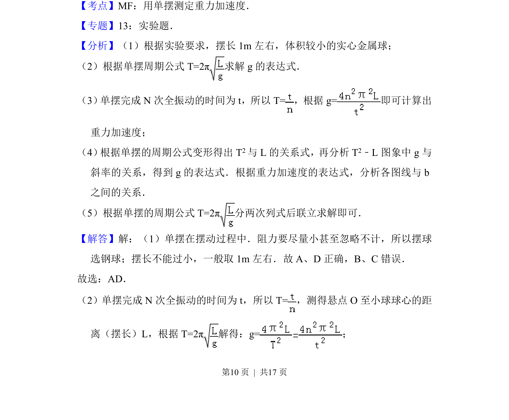
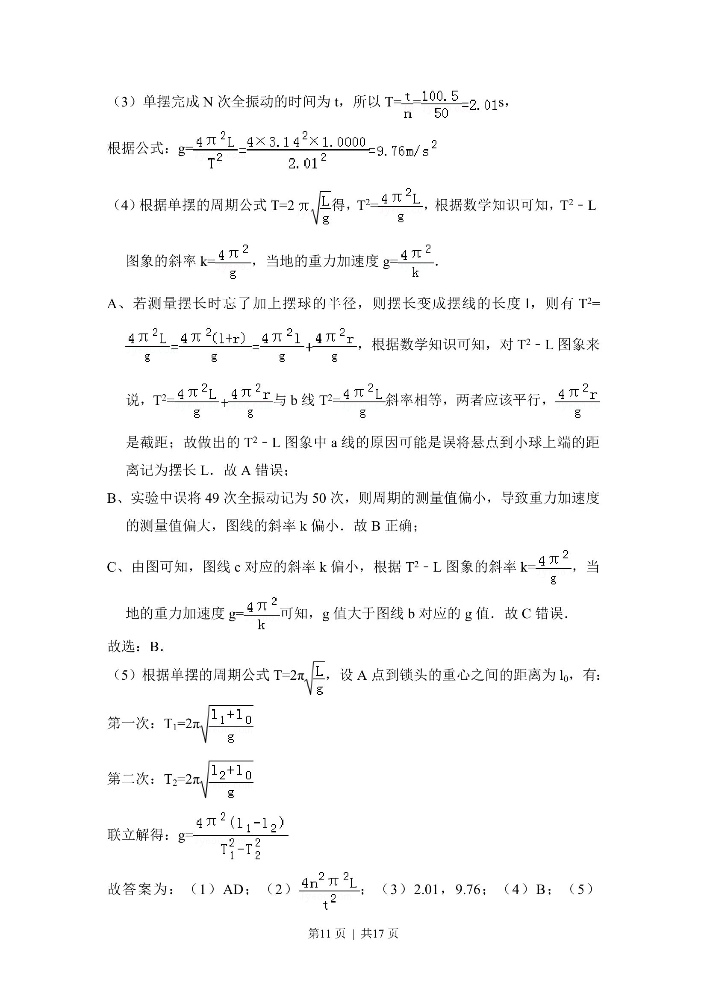
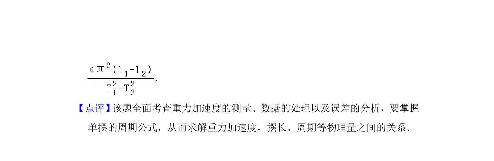

## 题面

## 摘要

考查用单摆测定重力加速度的实验，包括器材选择、周期公式计算、数据处理及T²-L图像误差分析。

## 关联考点

- [[单摆测定重力加速度]]
- [[351-单摆周期公式|单摆周期公式]]
- [[582-实验数据处理|实验数据处理]]
- [[725-误差分析|误差分析]]

## 答案与解析

> 📄 原 PDF 第 9 页：`素材/真题/北京/2008-2024·（北京）物理高考真题/2015年高考物理试卷（北京）（解析卷）.pdf`
