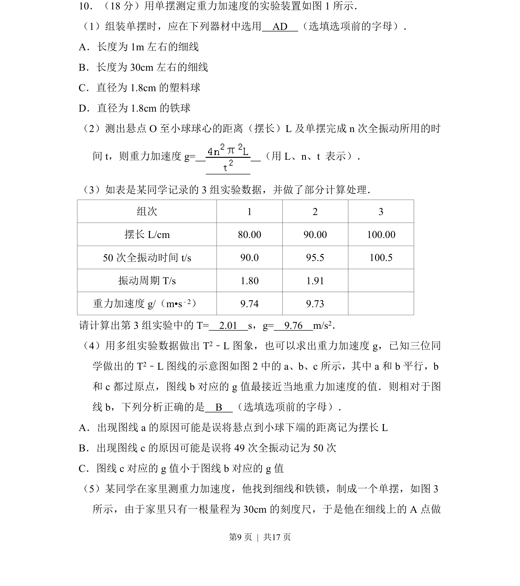
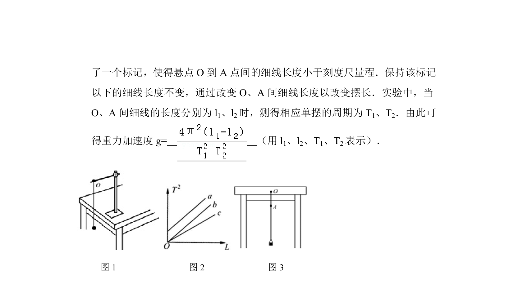
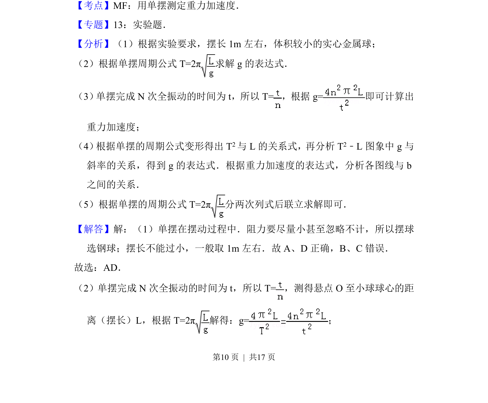
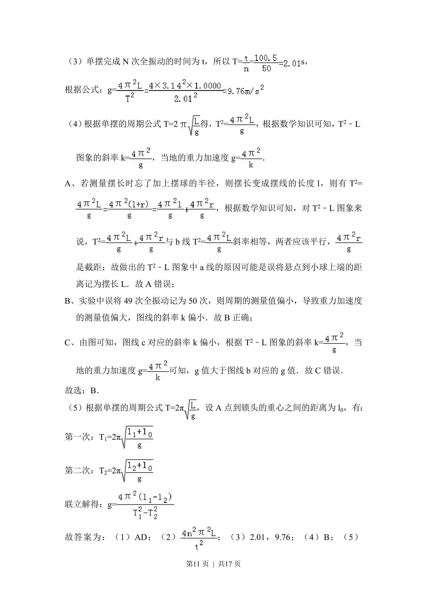
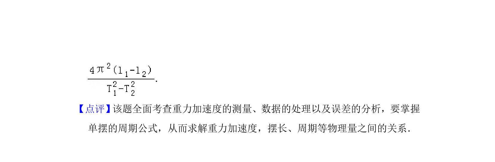

## 题面

## 摘要

考查用单摆测定重力加速度的实验，包括器材选择、周期公式计算、数据处理及T²-L图像误差分析。

## 关联考点

- [[单摆测定重力加速度]]
- [[351-单摆周期公式|单摆周期公式]]
- [[582-实验数据处理|实验数据处理]]
- [[724-误差分析|误差分析]]

## 答案与解析

> 📄 原 PDF 第 9 页：`素材/真题/北京/2008-2024·（北京）物理高考真题/2015年高考物理试卷（北京）（解析卷）.pdf`

<!-- 题干文本-start -->
## 题干文本
10．（18分）用单摆测定重力加速度的实验装置如图1所示．
（1）组装单摆时，应在下列器材中选用　AD　（选填选项前的字母）．
A．长度为1m左右的细线
B．长度为30cm左右的细线
C．直径为1.8cm的塑料球
D．直径为1.8cm的铁球
（2）测出悬点O至小球球心的距离（摆长）L及单摆完成n次全振动所用的时
间t，则重力加速度g=　 　（用L、n、t 表示）．
（3）如表是某同学记录的3组实验数据，并做了部分计算处理．
组次 1 2 3
摆长L/cm 80.00 90.00 100.00
50次全振动时间t/s 90.0 95.5 100.5
振动周期T/s 1.80 1.91
重力加速度g/（m•s ﹣2） 9.74 9.73
请计算出第3组实验中的T=　2.01　s，g=　9.76　m/s 2．
（4）用多组实验数据做出T 2﹣L图象，也可以求出重力加速度g，已知三位同
学做出的T 2﹣L图线的示意图如图2中的a、b、c所示，其中a和b平行，b
和c都过原点，图线b对应的g值最接近当地重力加速度的值．则相对于图
线b，下列分析正确的是　B　（选填选项前的字母）．
A．出现图线a的原因可能是误将悬点到小球下端的距离记为摆长L
B．出现图线c的原因可能是误将49次全振动记为50次
C．图线c对应的g值小于图线b对应的g值
（5）某同学在家里测重力加速度，他找到细线和铁锁，制成一个单摆，如图3
所示，由于家里只有一根量程为30cm的刻度尺，于是他在细线上的A点做
<!-- 题干文本-end -->

<!-- 解析文本-start -->
## 解析文本

<!-- 解析文本-end -->
