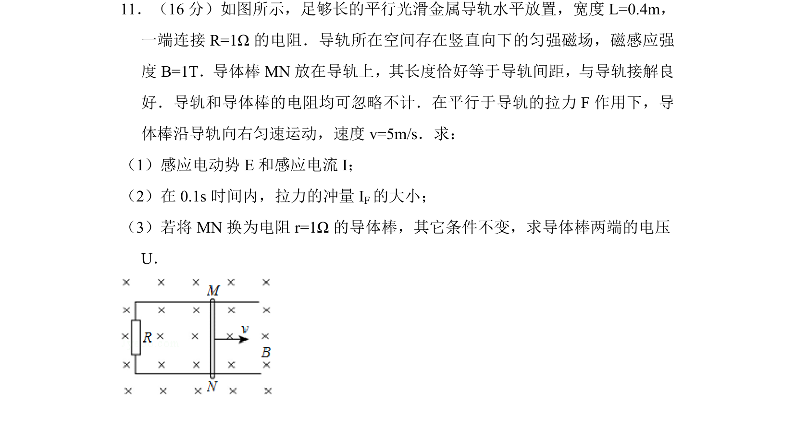
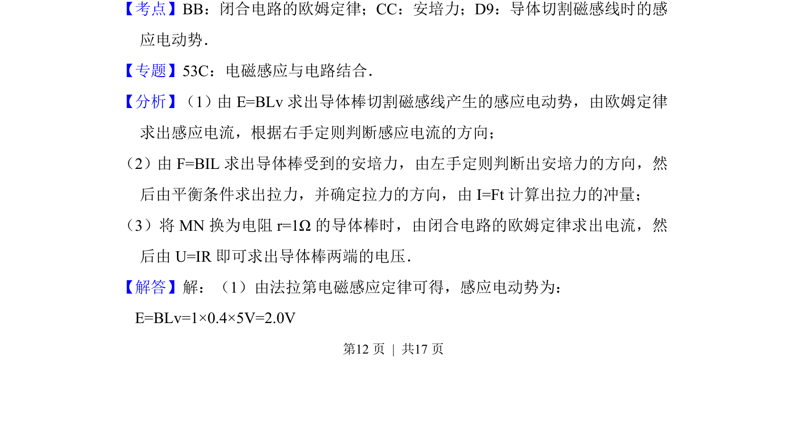
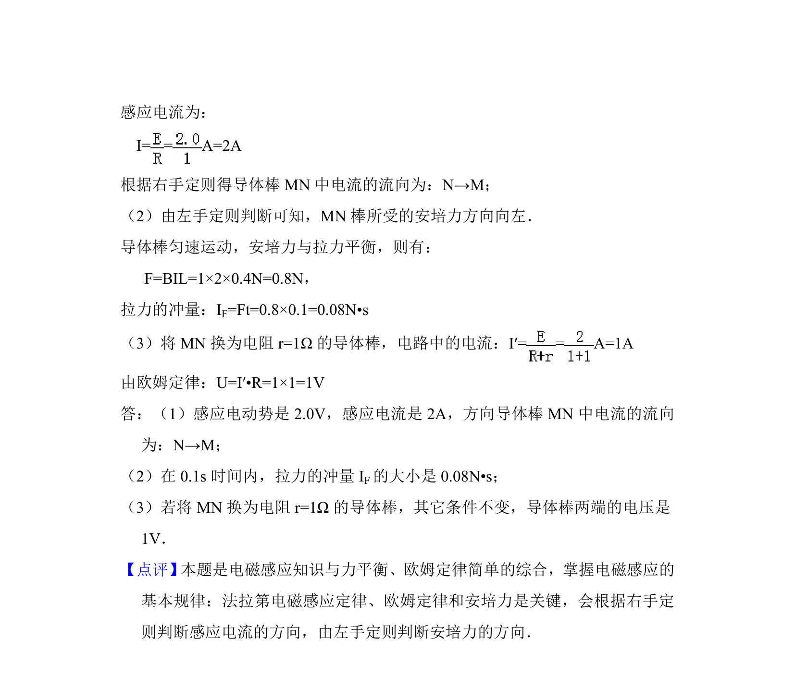

## 题面

## 摘要

导体棒切割磁感线产生感应电动势，结合闭合电路欧姆定律求电流，并计算安培力冲量与路端电压。

## 关联考点

- [[590-导体切割磁感线时的感应电动势|导体切割磁感线时的感应电动势]]
- [[332-闭合电路欧姆定律|闭合电路欧姆定律]]
- [[188-磁场对通电导体的作用|安培力]]
- [[345-冲量|冲量]]

## 答案与解析

> 📄 原 PDF 第 12 页：`素材/真题/北京/2008-2024·（北京）物理高考真题/2015年高考物理试卷（北京）（解析卷）.pdf`
