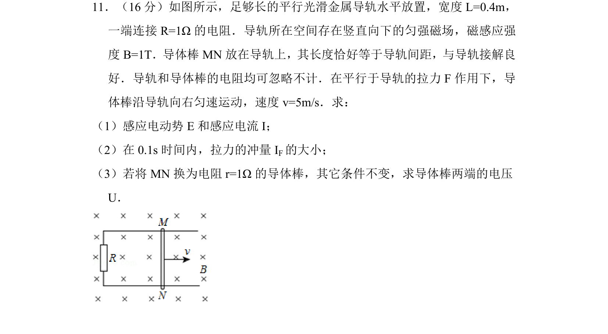
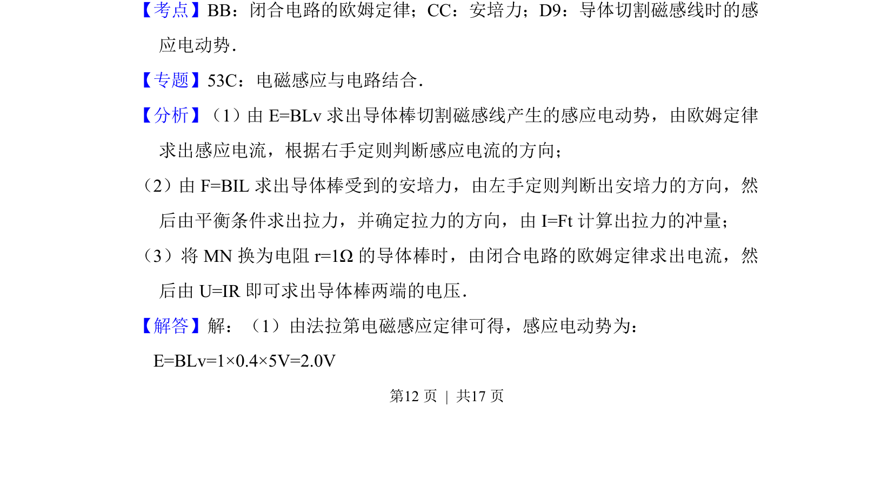
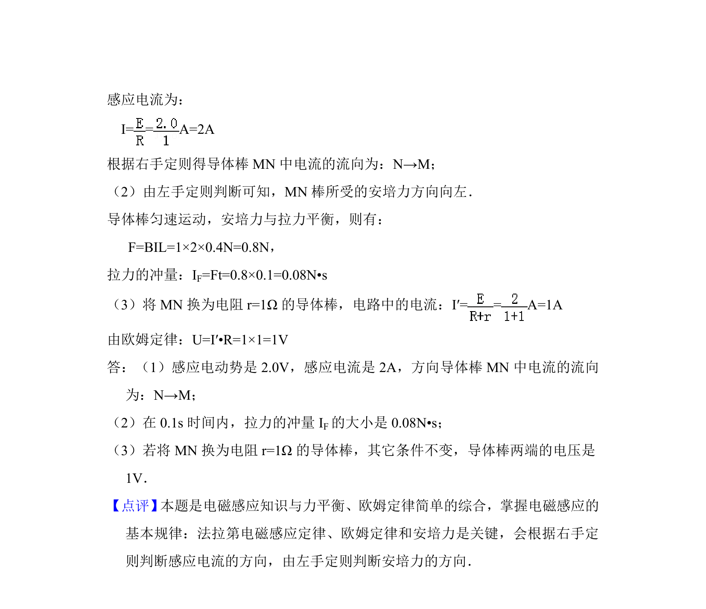

## 题面

## 摘要

导体棒切割磁感线产生感应电动势，结合闭合电路欧姆定律求电流，并计算安培力冲量与路端电压。

## 关联考点

- [[590-导体切割磁感线时的感应电动势|导体切割磁感线时的感应电动势]]
- [[332-闭合电路欧姆定律|闭合电路欧姆定律]]
- [[188-磁场对通电导体的作用|安培力]]
- [[345-冲量|冲量]]

## 答案与解析

> 📄 原 PDF 第 12 页：`素材/真题/北京/2008-2024·（北京）物理高考真题/2015年高考物理试卷（北京）（解析卷）.pdf`

<!-- 题干文本-start -->
## 题干文本
11．（16分）如图所示，足够长的平行光滑金属导轨水平放置，宽度L=0.4m，
一端连接R=1Ω的电阻．导轨所在空间存在竖直向下的匀强磁场，磁感应强
度B=1T．导体棒MN放在导轨上，其长度恰好等于导轨间距，与导轨接解良
好．导轨和导体棒的电阻均可忽略不计．在平行于导轨的拉力F作用下，导
体棒沿导轨向右匀速运动，速度v=5m/s．求：
（1）感应电动势E和感应电流I；
（2）在0.1s时间内，拉力的冲量I F的大小；
（3）若将MN换为电阻r=1Ω的导体棒，其它条件不变，求导体棒两端的电压
U．
<!-- 题干文本-end -->

<!-- 解析文本-start -->
## 解析文本
【考点】BB：闭合电路的欧姆定律；CC：安培力；D9：导体切割磁感线时的感
应电动势．菁优网版权所有
【专题】53C：电磁感应与电路结合．
【分析】（1）由E=BLv求出导体棒切割磁感线产生的感应电动势，由欧姆定律
求出感应电流，根据右手定则判断感应电流的方向；
（2）由F=BIL求出导体棒受到的安培力，由左手定则判断出安培力的方向，然
后由平衡条件求出拉力，并确定拉力的方向，由I=Ft计算出拉力的冲量；
（3）将MN换为电阻r=1Ω的导体棒时，由闭合电路的欧姆定律求出电流，然
后由U=IR即可求出导体棒两端的电压．
【解答】解：（1）由法拉第电磁感应定律可得，感应电动势为：
  E=BLv=1×0.4×5V=2.0V
<!-- 解析文本-end -->
