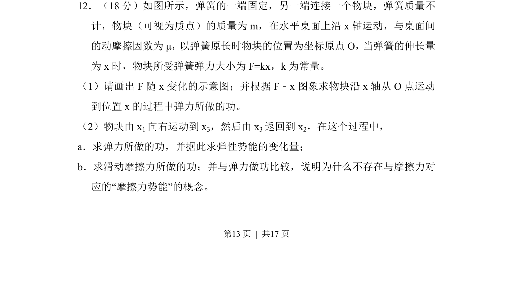
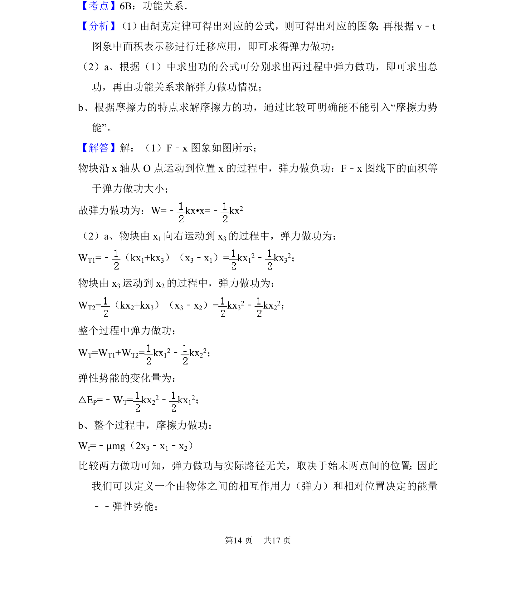
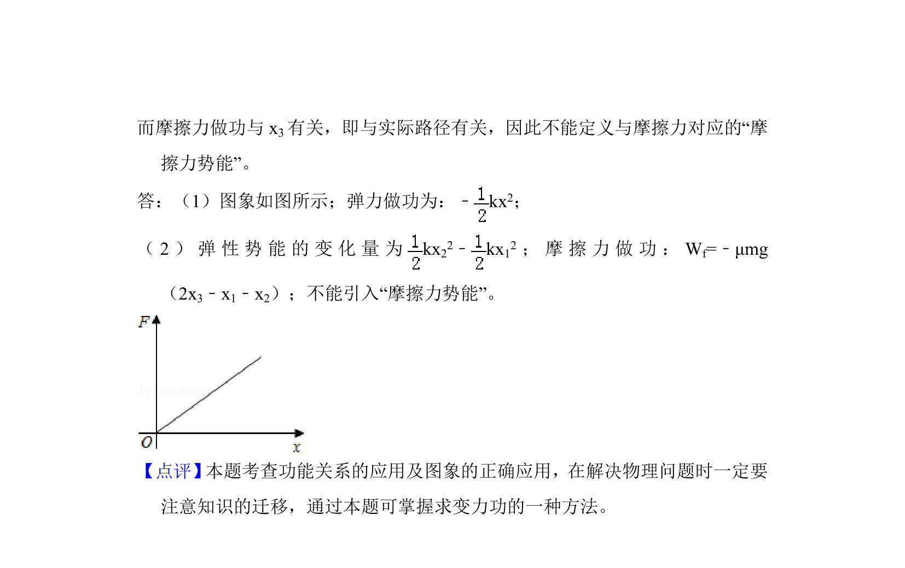

## 题面

## 摘要

物块在弹簧弹力和摩擦力作用下运动，求弹力做功、弹性势能变化及摩擦力做功，并解释无摩擦力势能。

## 关联考点

- [[弹力做功]]
- [[079-弹性势能|弹性势能]]
- [[765-摩擦力做功|摩擦力做功]]
- [[保守力]]

## 答案与解析

> 📄 原 PDF 第 13 页：`素材/真题/北京/2008-2024·（北京）物理高考真题/2015年高考物理试卷（北京）（解析卷）.pdf`

<!-- 题干文本-start -->
## 题干文本
12．（18分）如图所示，弹簧的一端固定，另一端连接一个物块，弹簧质量不
计，物块（可视为质点）的质量为m，在水平桌面上沿x轴运动，与桌面间
的动摩擦因数为μ，以弹簧原长时物块的位置为坐标原点O，当弹簧的伸长量
为x时，物块所受弹簧弹力大小为F=kx，k为常量。
（1）请画出F随x变化的示意图；并根据F﹣x图象求物块沿x轴从O点运动
到位置x的过程中弹力所做的功。
（2）物块由x 1向右运动到x 3，然后由x 3返回到x 2，在这个过程中，
a．求弹力所做的功，并据此求弹性势能的变化量；
b．求滑动摩擦力所做的功；并与弹力做功比较，说明为什么不存在与摩擦力对
应的“摩擦力势能”的概念。
<!-- 题干文本-end -->

<!-- 解析文本-start -->
## 解析文本

<!-- 解析文本-end -->
